# Critical Thinking Automated Deployment -- Project Documentation

## Overview

In this project, I implemented an automated infrastructure deployment on
AWS using **Ansible** and **GitHub Actions**. The goal was to ensure
that every push to the `main` branch automatically triggered
provisioning and configuration of AWS resources.

------------------------------------------------------------------------

## Objectives
The main goals of this project are:

- Automate AWS infrastructure deployment using Ansible
- Trigger deployments automatically via GitHub Actions
- Provision and configure EC2 instances
- Create and mount an Amazon EFS file system
- Install and configure Apache and MySQL (MariaDB)
- Securely integrate AWS credentials using GitHub Secrets
- Implement error handling and failure notifications


## Step 1: Repository Setup

I created a GitHub repository named
**Critical-Thinking-Automated-Deployment**.\
I added a `README.md` file explaining the project goal, tools used, and
expected outcomes.

**Outcome:**\
The repository structure was ready for CI/CD integration.

------------------------------------------------------------------------

## Step 2: GitHub Actions Configuration

I configured a GitHub Actions workflow to trigger on every push to the
`main` branch.

### What I did:

-   Set up Python 3.12 in the runner
-   Created a virtual environment
-   Installed Ansible, boto3, and botocore
-   Configured AWS credentials securely using GitHub Secrets
-   Used `ssh-agent` to securely inject the EC2 SSH private key
-   Triggered Ansible playbook execution

### I added Screenshots
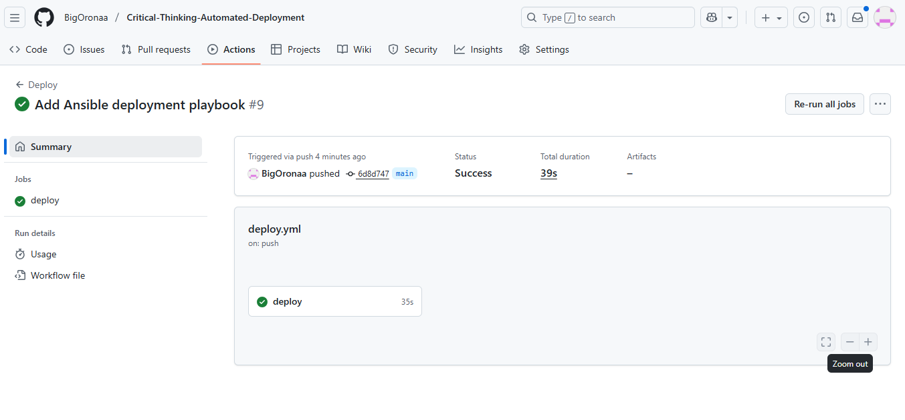

**Error Encountered:** The first commit failed due to, ` couldn't resolve module/action 'amazon.aws.efs'. This often indicates a misspelling, missing collection, or incorrect module path.` i fixed it by using community.aws.efs.

### I added Screenshots
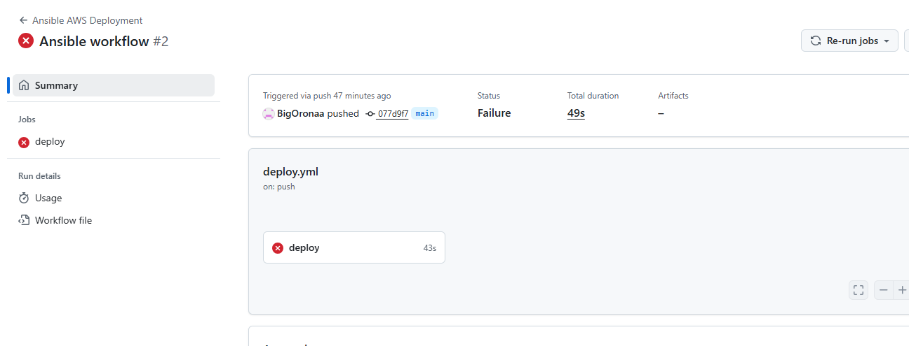

------------------------------------------------------------------------

## Step 3: EC2 Provisioning and Configuration

I used Ansible to configure an EC2 instance.

### Tasks completed:

-   Updated system packages
-   Installed Docker and Git
-   Enabled and started Docker
-   Added `ec2-user` to the Docker group

### I added Screenshots
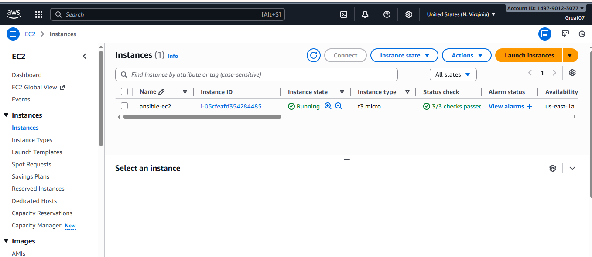
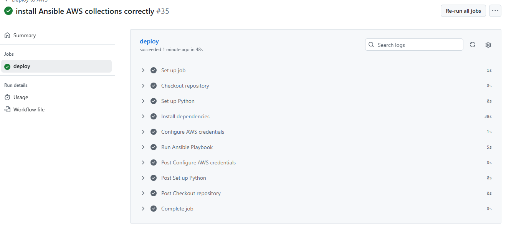


------------------------------------------------------------------------

## Step 4: EFS Creation and Mounting

I created an EFS file system using Ansible.

### I added Screenshots
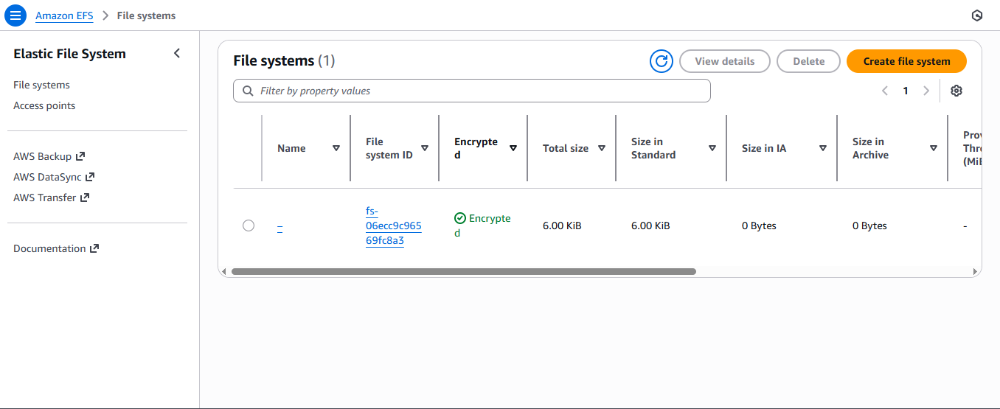
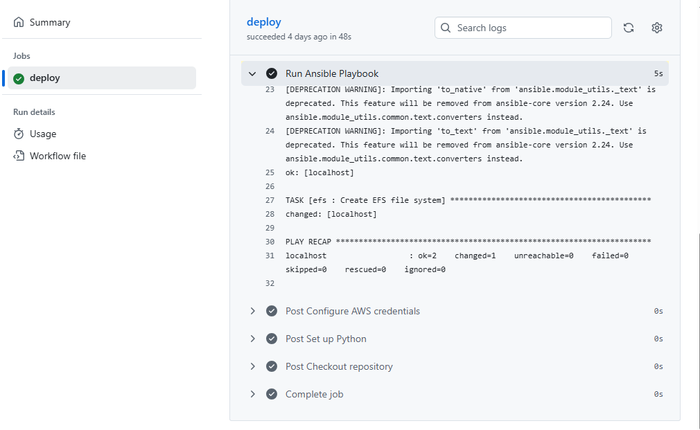

### Errors Encountered:

-   Repeated failures with:
    -   `amazon.aws.efs_mount_target`
    -   `community.aws.efs_mount_target`

### Resolution:

-  I Enabled SSH from ansible so i can ssh into the instance
-   Mounted EFS manually on the EC2 instance
-   Confirmed mount using `df -h`

### I added Screenshots
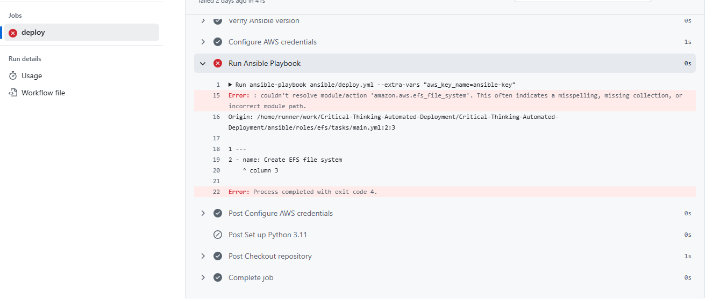


------------------------------------------------------------------------

## Step 5: Apache Installation

 I updated the configure-ec2/main.yml to install and configure Apache on the EC2 instance.

### I added Screenshots
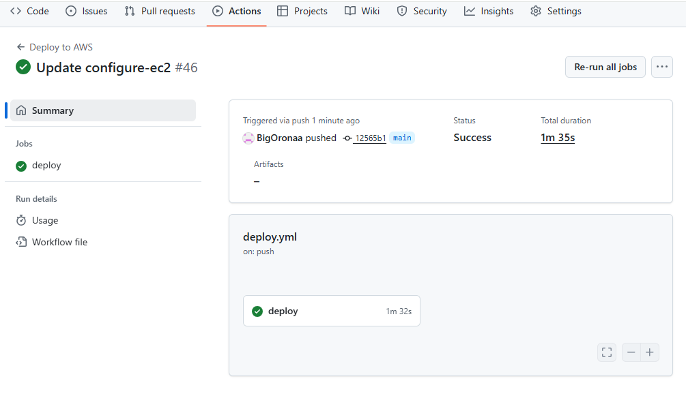
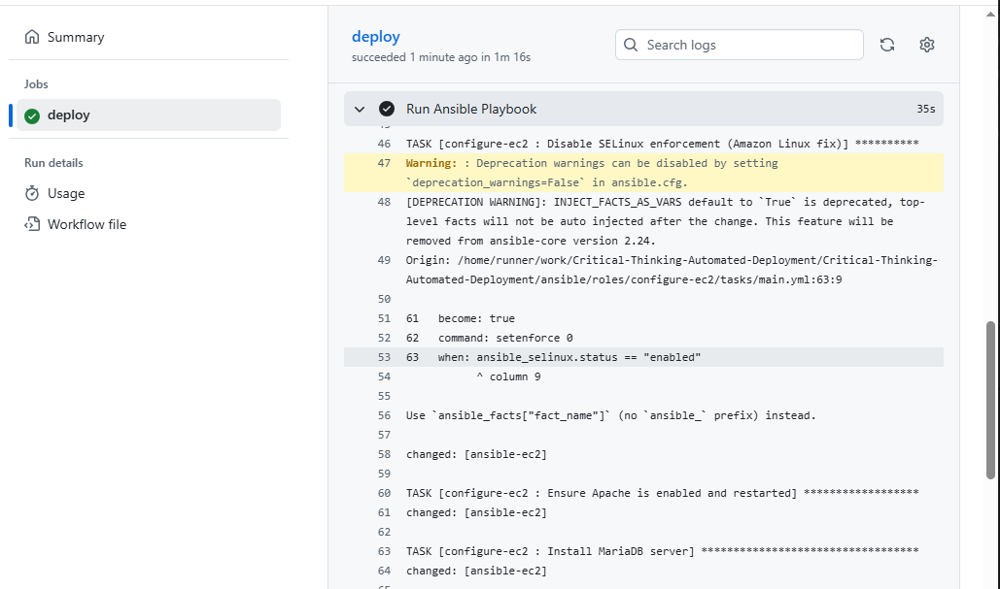
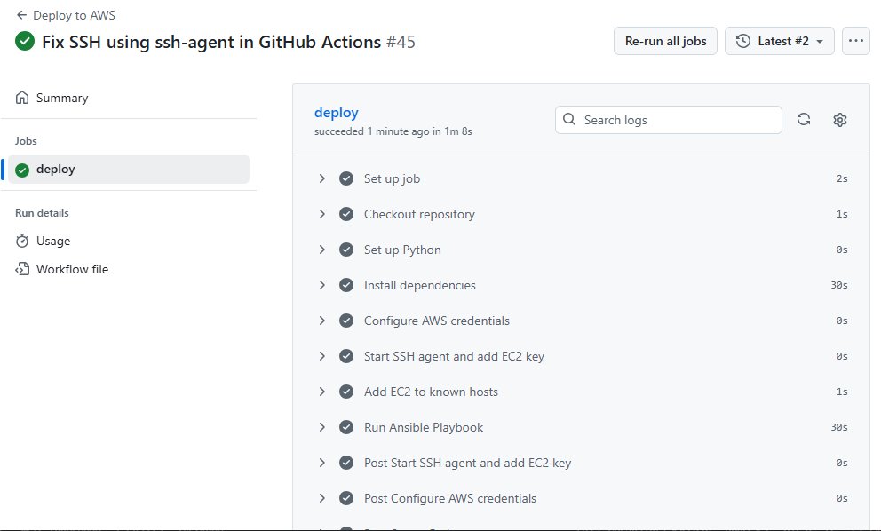


### Error Encountered:

-   Apache failed to start due to port 80 already in use

### Resolution:

-   Identified conflicting service
-   Restarted Apache successfully

### I added Screenshots
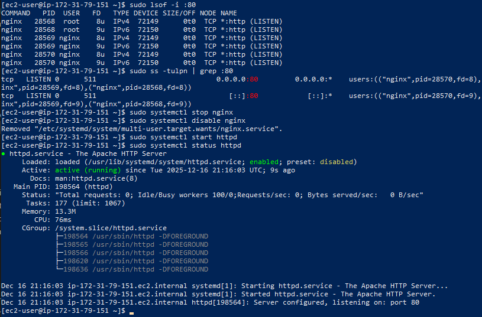

------------------------------------------------------------------------

## Step 6: MySQL (MariaDB) Installation

I installed MariaDB as the MySQL-compatible database.

### Errors Encountered:

-   `mysql-server` package not found
-   `amazon-linux-extras` not available

### Resolution:

-   Installed MariaDB from default Amazon Linux repositories

### I added Screenshots


------------------------------------------------------------------------

## step 7: Error handling
i tested Error handling by forcing MariaDB to fail on the play book.

### I added Screenshots


## step 8: Notifications
i ensured the workflows playbook sees notifications.

### I added Screenshots
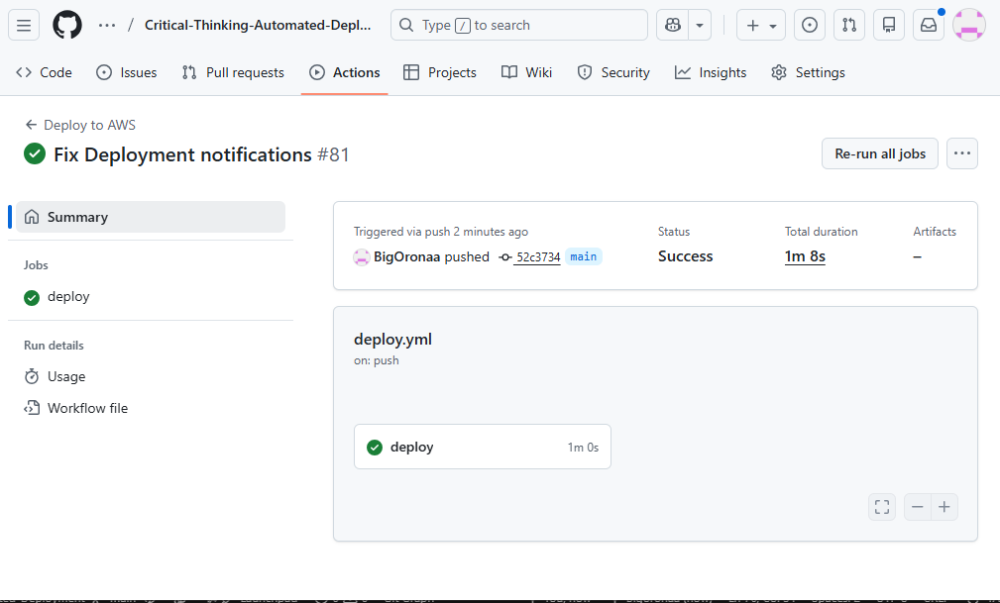


## Step 7: Validation and Testing

I validated the deployment by: - Confirming GitHub Actions workflow
success - Verifying EC2 access - Confirming Apache, MariaDB, and EFS
functionality

### I added Screenshots


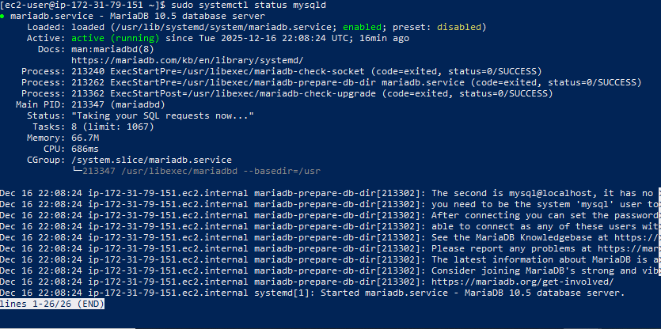


------------------------------------------------------------------------

## Final Outcome

-   Fully automated deployment pipeline
-   Stable infrastructure on AWS
-   Errors documented and resolved

------------------------------------------------------------------------

## Conclusion

This project demonstrates a complete DevOps CI/CD workflow using GitHub
Actions, Ansible, and AWS.


## Repository Structure

```
Critical-Thinking-Automated-Deployment/
│
├── ansible/
│   ├── deploy.yml
│   ├── inventory.ini
│   ├── roles/
│   │   ├── ec2/
│   │   │   └── tasks/main.yml
│   │   ├── efs/
│   │   │   └── tasks/main.yml
│   │   ├── apache/
│   │   │   └── tasks/main.yml
│   │   ├── mysql/
│   │   │   └── tasks/main.yml
│   │
│   └── collections/   (this will contain amazon.aws after install)
│
├── .github/
│   └── workflows/
│       └── deploy.yml
│
└── README.md
```
**Ansible Repo** I created a repo that all the github action ran. 
### Link to the repo: [hhttps://github.com/BigOronaa/Critical-Thinking-Automated-Deployment](https://github.com/BigOronaa/Critical-Thinking-Automated-Deployment)