# Ansible Web-Server Lab Documentation

## Objective
I set out to use Ansible to provision and configure two web servers (Nginx and Apache) with custom HTML files. Additionally, I installed Wireshark on both servers for network monitoring and enabled basic authentication on Nginx.

---

## Step 1: Create Project Directory
I created a project directory on my WSL Ubuntu instance and initialized the file structure:

```bash
mkdir ansible-web-lab
cd ansible-web-lab
touch inventory.ini test.yml apache.yml nginx.yml wireshark.yml main.yml
mkdir files templates group_vars
```
### I added screenshots
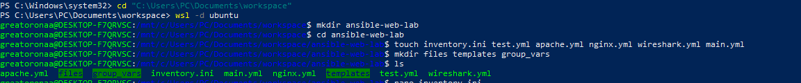

Directory structure created:
```yaml
ansible-web-lab/
│
├── inventory.ini
├── main.yml
├── nginx.yml
├── apache.yml
├── wireshark.yml
│
├── files/
│   └── index.html.j2
│
└── templates/
    └── nginx_basic_auth.conf.j2
```


## Step 2: Set up Target Servers
I created two AWS Ubuntu instances:
- Nginx Server: `54.82.1.35`
- Apache Server: `52.90.99.210`

I verified SSH access using my private key:
```bash
ssh -i ~/.ssh/ansible-key-ci.pem ubuntu@54.82.1.35
ssh -i ~/.ssh/ansible-key-ci.pem ubuntu@52.90.99.210
```

I successfully connected to both servers.

### I added screenshots
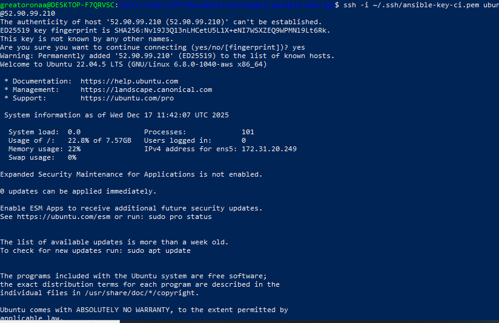
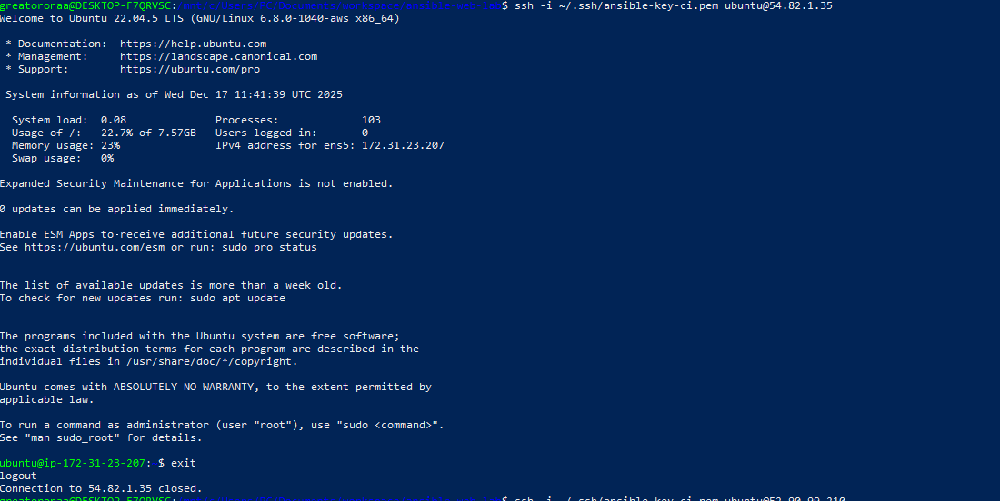

---

## Step 3: Verify SSH Connectivity with Ansible
I tested connectivity with Ansible ping module:
```bash
ansible -i inventory.ini -m ping all
```
Both servers responded with `pong`, confirming Ansible could communicate over SSH.

### I added screenshots
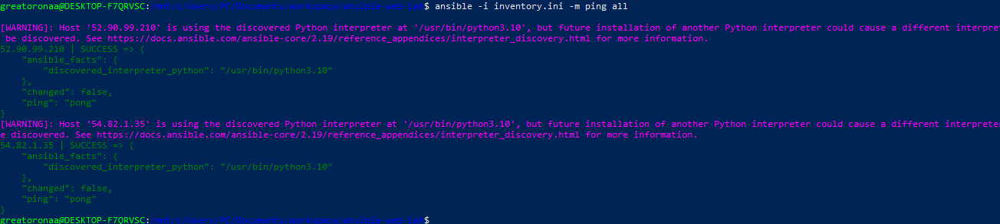

---

## Step 4: Nginx Playbook
I created `nginx.yml` to install and configure Nginx, deploy a custom HTML file, install `passlib`, and configure basic authentication.

I ran:
```bash
ansible-playbook -i inventory.ini nginx.yml
```

### I added screenshots
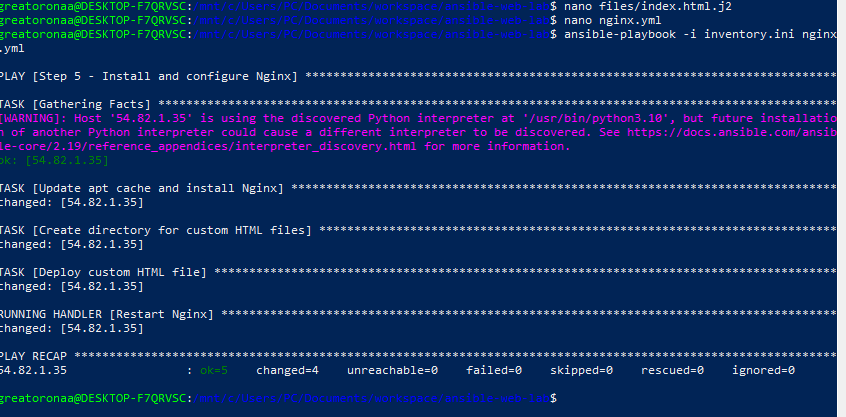


**Errors encountered:**
- Initially, I got `site_name is not a valid attribute` error. I fixed this by moving `vars:` under the playbook level correctly.
- Later, I encountered `Failed to import the required Python library (passlib)` error. I fixed this by installing `python3-passlib` on the target server within the playbook.

After fixing, the playbook successfully deployed:
- Custom HTML file
- Basic authentication prompt on the Nginx server
- Restarted Nginx service

Browser verification: I saw the custom page with a login prompt.

### I added screenshots
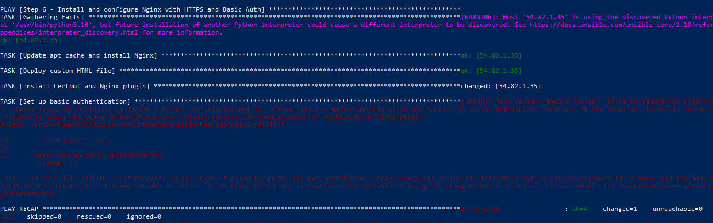
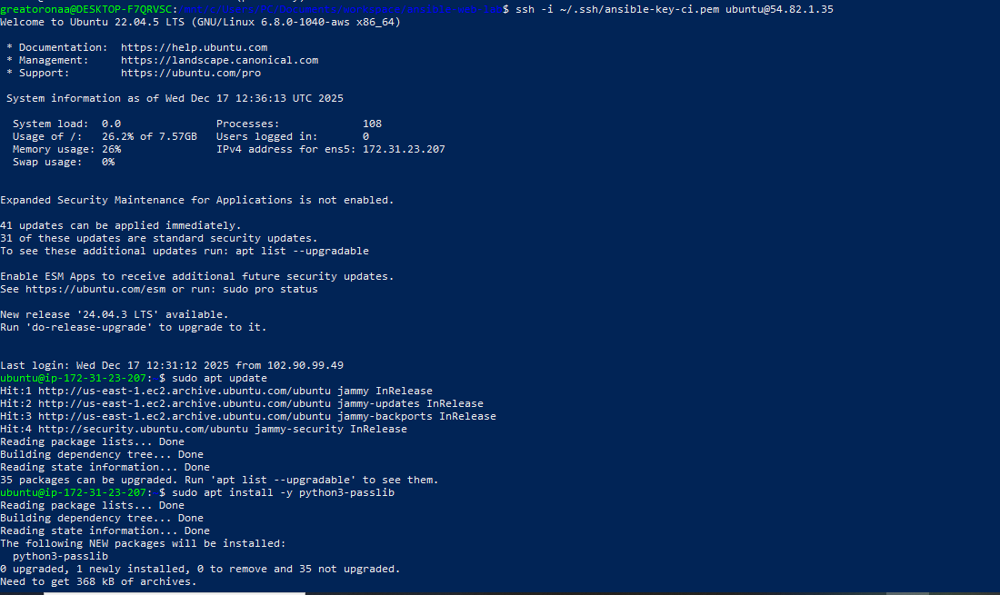
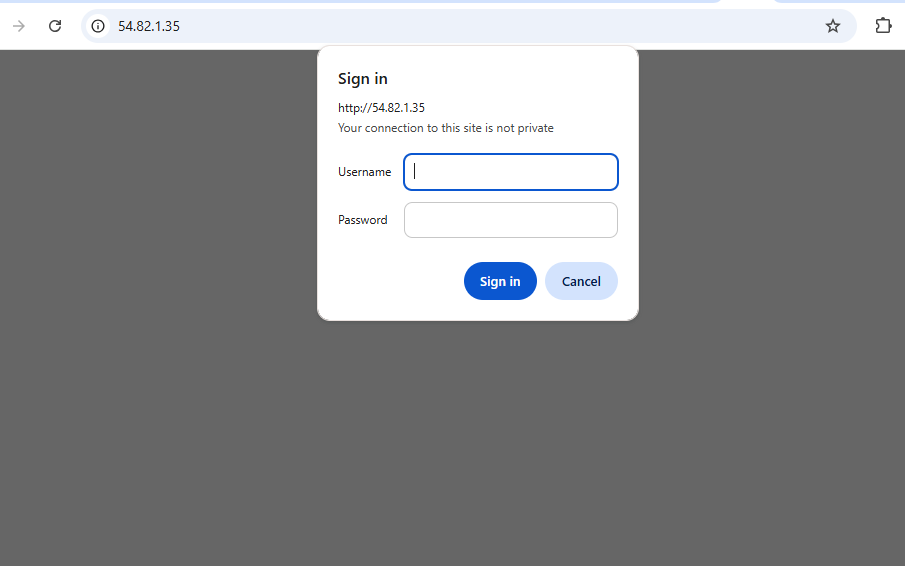
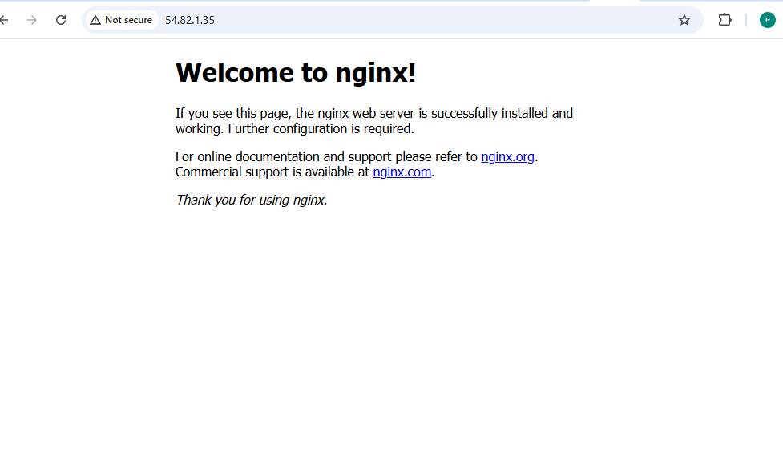
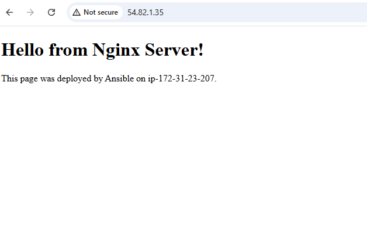

---

## Step 5: Apache Playbook
I created `apache.yml` to install Apache and deploy a custom HTML page:
```bash
ansible-playbook -i inventory.ini apache.yml
```

The playbook successfully:
- Installed Apache2
- Created `/var/www/html/mywebsite` directory
- Deployed custom HTML
- Restarted Apache service

Browser verification: I saw the custom HTML page at `http://52.90.99.210/mywebsite`.


### I added screenshots
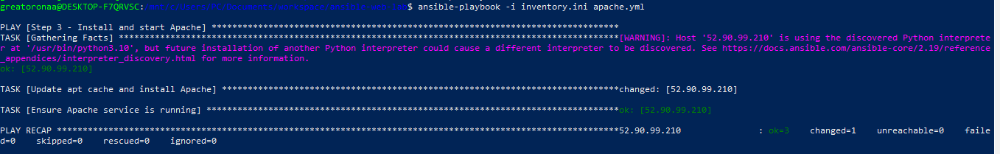
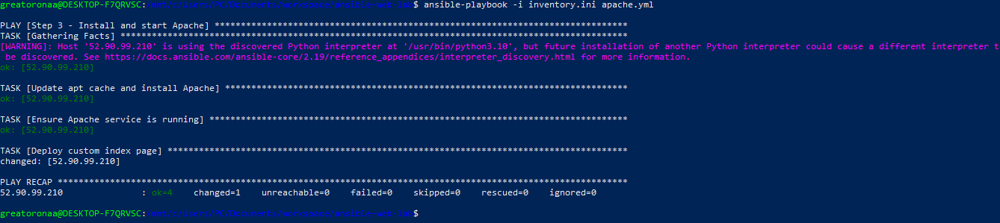
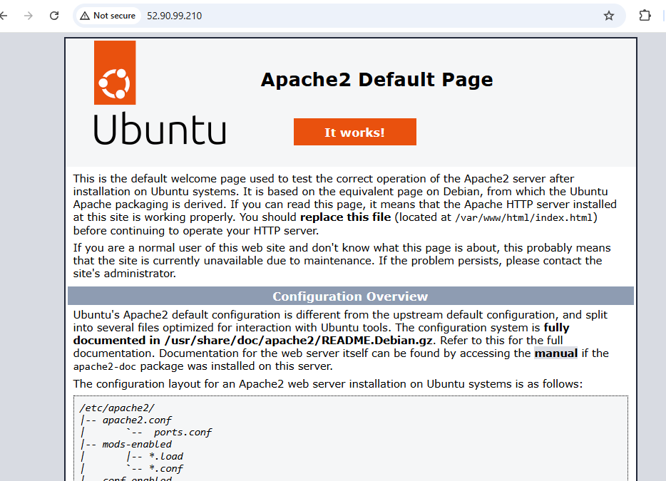
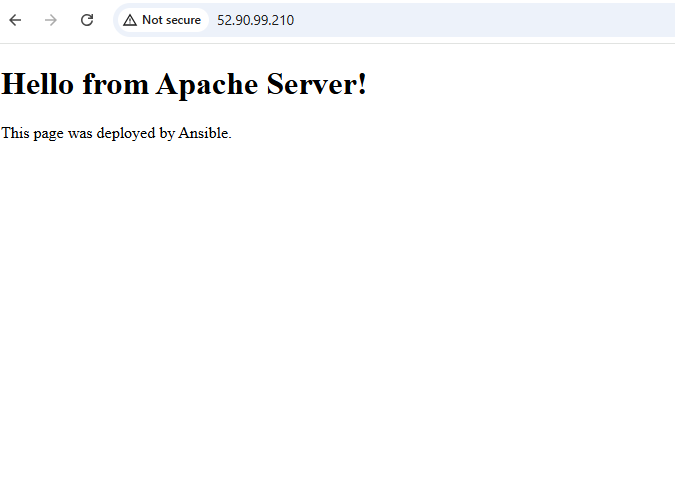
---

## Step 6: Wireshark Playbook
I created `wireshark.yml` to install Wireshark on both servers:
```bash
ansible-playbook -i inventory.ini wireshark.yml
```

Verification:
```bash
ssh ubuntu@54.82.1.35
wireshark --version
ssh ubuntu@52.90.99.210
wireshark --version
```
Both servers showed the Wireshark version.

### I added screenshots
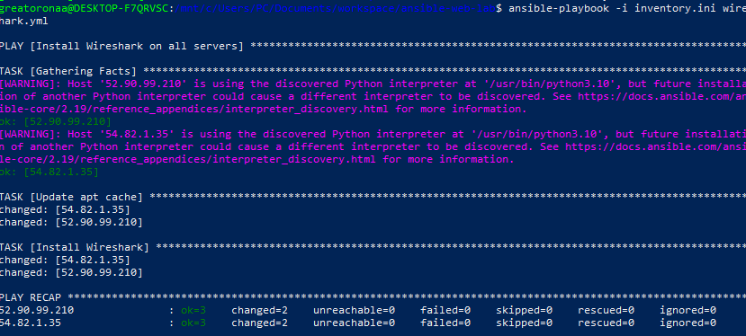
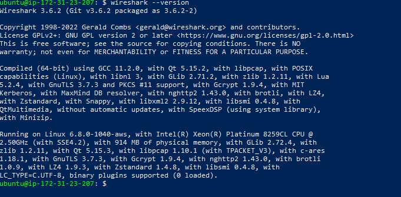
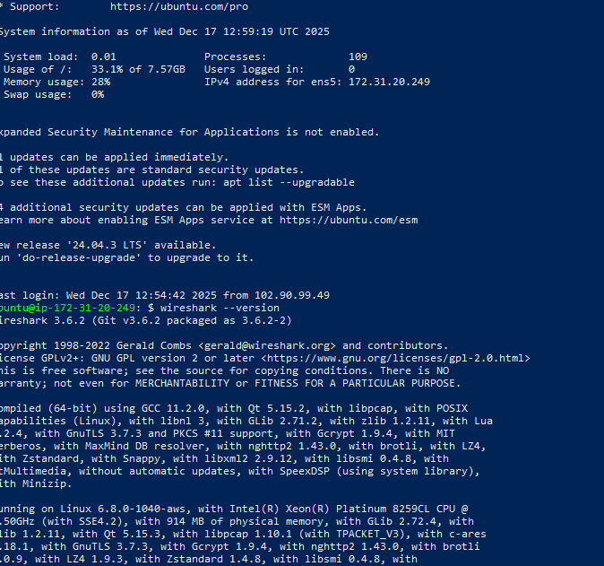

---

## Step 7: Main Playbook
I created `main.yml` to run all playbooks in order. Initially, I wrote:
```yaml
- name: Main Playbook
  hosts: all
  become: true
  gather_facts: false
  tasks:
    - import_playbook: nginx.yml
    - import_playbook: apache.yml
    - import_playbook: wireshark.yml
```
### I added screenshots
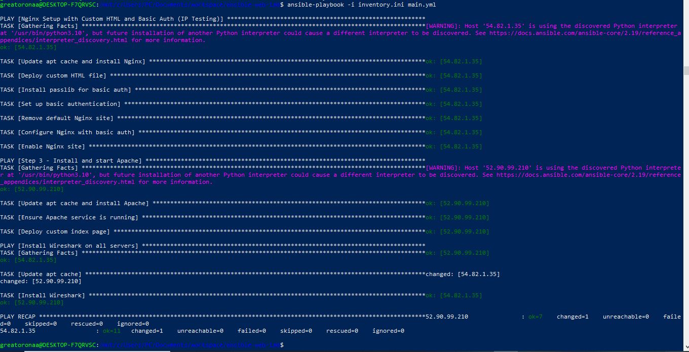

**Errors encountered:**
- `Action 'ansible.builtin.import_playbook' does not support raw params` → caused by placing `import_playbook` under `tasks:`
- `YAML parsing failed: Mapping values are not allowed in this context` → caused by indentation and invalid placement under `tasks:`

I fixed it by writing `main.yml` as:
```yaml
---
- import_playbook: nginx.yml
- import_playbook: apache.yml
- import_playbook: wireshark.yml
```

Then I ran:
```bash
ansible-playbook -i inventory.ini main.yml
```
The playbook successfully executed all three playbooks in order without errors.

### I added screenshots


---

## Verification
1. **Nginx Server:** `http://54.82.1.35` → login prompt appeared → custom HTML page displayed.
2. **Apache Server:** `http://52.90.99.210/mywebsite` → custom HTML page displayed.
3. **Wireshark:** Verified installation on both servers with `wireshark --version`.

---

## Conclusion
I successfully completed the Ansible Web-Server Lab:
- Configured Nginx with custom HTML and basic authentication
- Configured Apache with custom HTML
- Installed Wireshark on both servers
- Created a main playbook to automate all steps