# Multi-Tier Ansible Deployment Project Documentation

## Project Overview
This project automates deployment and configuration of a multi-tier web application using Ansible. The application consists of:
- Nginx load balancer
- Python-based application servers
- MySQL database server

Environments: Development, Staging, Production.

CI/CD is handled via GitHub Actions with environment-specific variables and email notifications.

---

## Directory Structure
```
multi-tier-ansible-v2/
├── inventories/
│   ├── development/
│   │   ├── hosts.ini
│   │   └── group_vars/db.yml
│   ├── staging/
│   │   ├── hosts.ini
│   │   └── group_vars/db.yml
│   └── production/
│       ├── hosts.ini
│       └── group_vars/db.yml
├── roles/
│   ├── nginx/
│   ├── app/
│   └── db/
├── site.yml
└── .github/workflows/deploy.yml
```

## Step-by-Step Implementation

### Step 1: Repository Setup
- I created a GitHub repository to store all Ansible-related files.
- I set up the directory structure for playbooks, inventories, and variable files for Development, Staging, and Production environments.
- I added a `README.md` explaining the project structure and instructions.

### Step 2: Environment-Specific Configuration
- I created `inventories/development/hosts.ini` and `group_vars/db.yml`.
- I added host details and database variables for Development.
- I created similar inventories and `group_vars/db.yml` for Staging and Production.


### Step 3: Role Creation
- I created roles for `nginx`, `app`, and `db`.
- **db Role Tasks:**
```yaml
- name: Install MySQL server
  apt:
    name: mysql-server
    state: present
    update_cache: yes
  become: yes

- name: Ensure MySQL service is running
  service:
    name: mysql
    state: started
    enabled: yes
  become: yes

- name: Ensure PyMySQL is available for Ansible MySQL modules
  pip:
    name: PyMySQL
    executable: /usr/bin/pip3
  become: yes

- name: Create database
  community.mysql.mysql_db:
    name: "{{ db_name }}"
    state: present
    login_user: root
    login_password: "{{ db_root_password }}"
  become: yes

- name: Create database user
  community.mysql.mysql_user:
    name: "{{ db_user }}"
    password: "{{ db_password }}"
    priv: "{{ db_name }}.*:ALL"
    state: present
    login_user: root
    login_password: "{{ db_root_password }}"
  become: yes
```

### Step 4: Local Playbook Testing
- I ran the playbook locally for Development:
```bash
ansible-playbook -i inventories/development/hosts.ini site.yml
```
- **Output:** All tasks succeeded with some warnings regarding Python interpreter discovery.
- I repeated this for Staging and Production.

### I added Screenshots
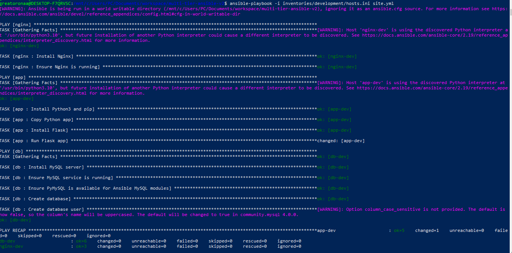
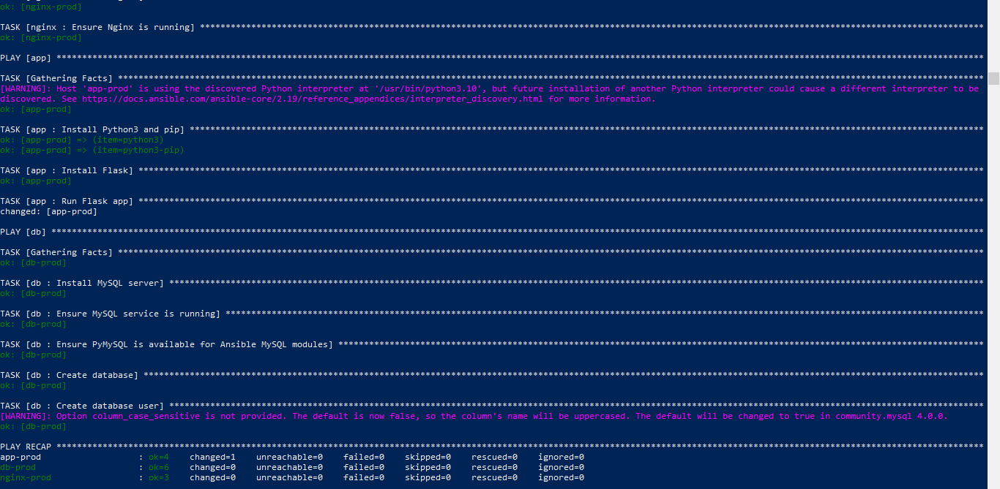
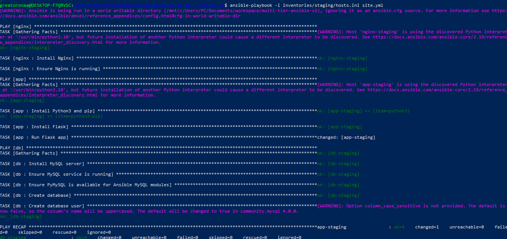


### Step 5: GitHub Actions Workflow Setup
- I created a workflow `deploy.yml` to automate playbook runs on `master` and `staging` branches.
- I added steps for:
  - Checking out code
  - Setting up Python and dependencies
  - Starting SSH agent and adding private key
  - Adding servers to `known_hosts`
  - Setting inventory file based on branch
  - Running Ansible playbook with environment variables from GitHub Secrets

### I added screenshots
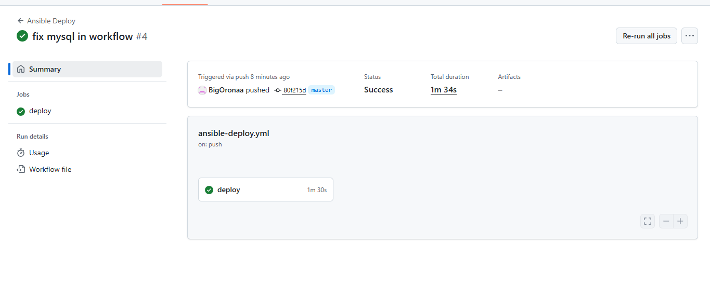

**Error Encountered:** The first commit failed and the github action showed this error `Unable to resolve action webfactory/ssh-agent@v0.8.1, unable to find version v0.8.1`. I fixed this by changing the version to `v0.9.0` and also `Could not find a version that satisfies the requirement community.mysql (from versions: none)` 

### I added screenshots


### Step 6: Remove DB Credentials from Workflow
- I removed direct DB credentials from the workflow.
- I ensured the playbook uses group_vars for database information.
- Workflow succeeded without exposing secrets.

### I added screenshots
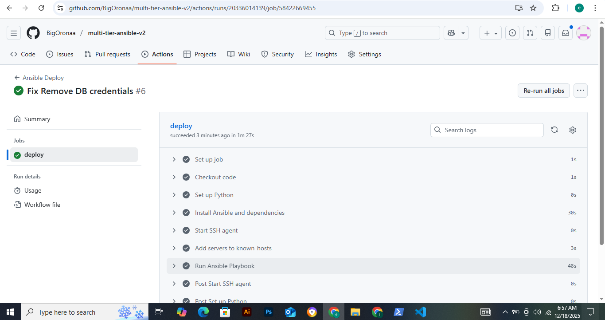

**Error Encountered:** The first automation failed because `Task failed to connect to the host via ssh: Can't open user config file ~/.ssh/config: No such file or directory`. This was fixed by adding `ansible_ssh_private_key_file=~/.ssh/ansible-key-ci.pem` to the host.ini/ initially i used .ssh/config. 


### I added screenshots
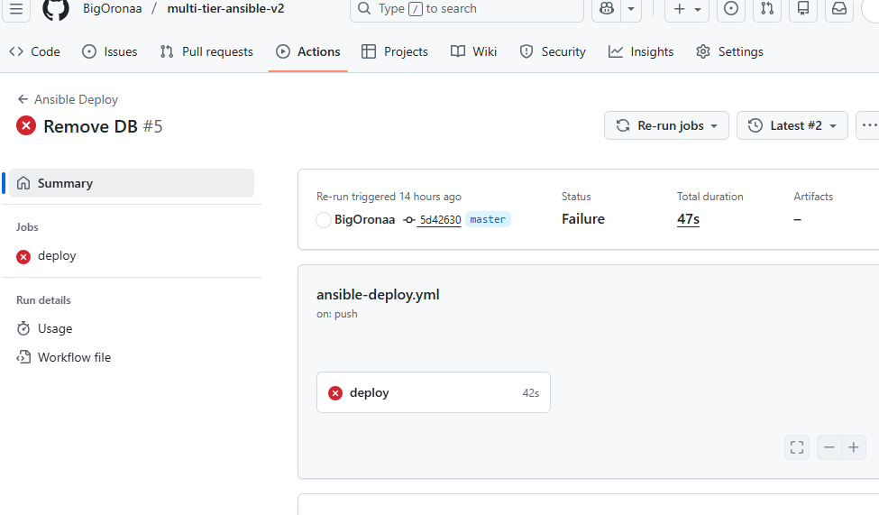


### Step 7: Branch Environment Mapping
- I added logic to select inventory based on the branch:
```bash
if [ "${GITHUB_REF_NAME}" = "master" ]; then
  echo "INVENTORY=inventories/production/hosts.ini" >> $GITHUB_ENV
elif [ "${GITHUB_REF_NAME}" = "staging" ]; then
  echo "INVENTORY=inventories/staging/hosts.ini" >> $GITHUB_ENV
else
  echo "Unsupported branch"
  exit 1
fi
```

### I added screenshots
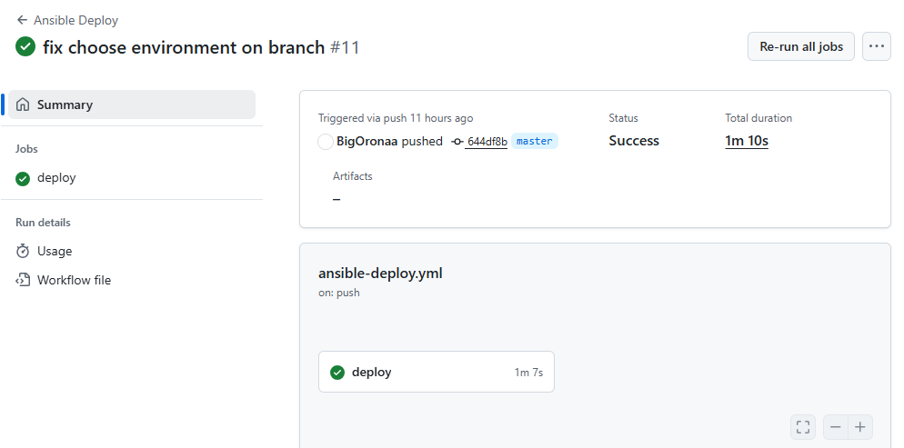

- **Errors Encountered:** Unsupported branch error if branch not `master` or `staging`.I changed the script to use master and not main.

### I added screenshots
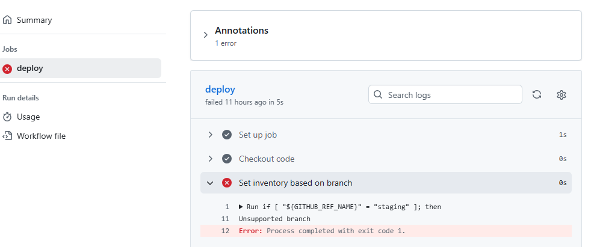

### Step 8: Error Handling
- I added retries and delay in critical tasks to ensure robustness.
- **Example:**
```yaml
retries: 3
delay: 10
```

### I added screenshots
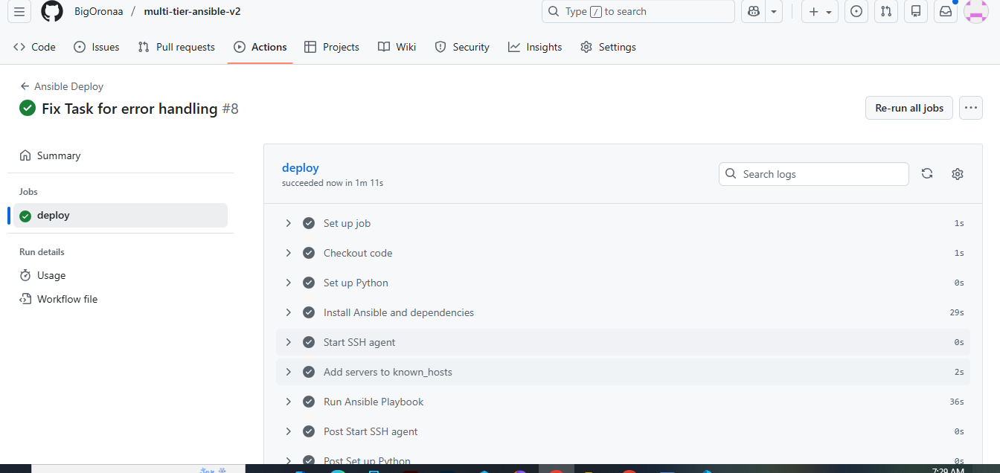

**Error Encountered:** There was a mistake on my script, i added my app to the db and this error made it fail `Task failed: Module failed, Unable to change directory before execution: [Errno 2] No such file or directory: b'/home/ubuntu/myapp`. 


### I added screenshots
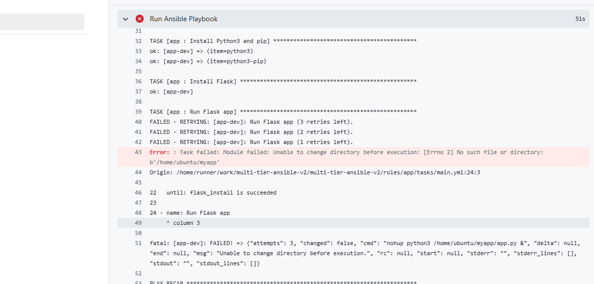


### Step 9: Email Notification Setup
- I configured `dawidd6/action-send-mail@v3` in workflow.
- I used Gmail SMTP with credentials stored in GitHub Secrets.

### I added screenshots
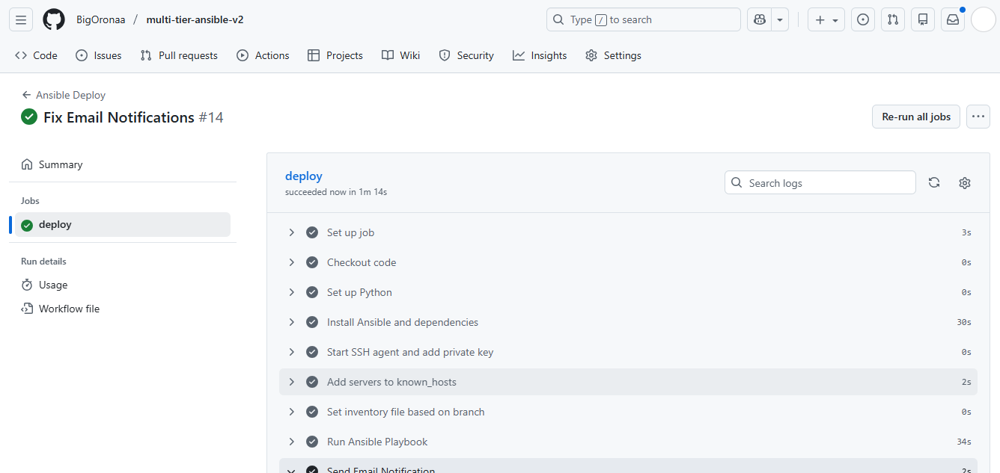


- **Errors Encountered:** SSL version error resolved by switching to port `587` with `secure: true`.
- Email is sent to the deployer (me) after every workflow run.

### I added screenshots
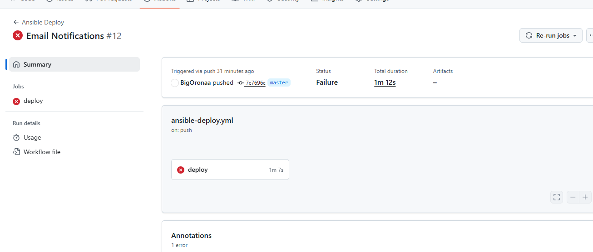


### Step 10: Workflow Run Verification
- I confirmed workflow runs on push to `master` and `staging`.
- I confirmed the Ansible playbooks executed successfully for all environments.
- Email notifications confirmed by checking Gmail inbox.

### I added screenshots
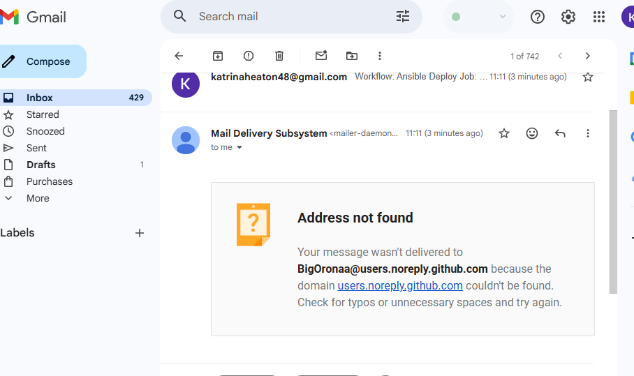


**MultiTier Ansible Repo** I created a repo that all the github action ran. 
### Link to the repo: [https://github.com/BigOronaa/multi-tier-ansible-v2](https://github.com/BigOronaa/multi-tier-ansible-v2)