# Critical Thinking – Configuring Docker Containers with Ansible  

##  Project Overview

In this project, I implemented an automated Docker container deployment system using Ansible and GitHub Actions.  
My goal was to ensure that Docker and multiple containers (web, database, cache) could be deployed consistently across **Development, Staging, and Production** environments with proper monitoring, logging, automation, and notifications.

## Repository Structure
```
ansible-docker-critical-thinking/
├── inventories/
│   ├── dev.ini
│   ├── staging.ini
│   └── production.ini
├── group_vars/
│   ├── dev.yml
│   ├── staging.yml
│   └── prod.yml
├── roles/
│   ├── docker/
│   ├── webserver/
│   ├── database/
│   └── cache/
├── playbooks/
│   ├── site.yml
│   └── monitor.yml
├── .github/workflows/
│   └── deploy.yml
└── README.md
```

## Implementations 

##  Repository Setup

I created a GitHub repository named **ansible-docker-critical-thinking**.  
I structured the repository following Ansible best practices, separating inventories, playbooks, roles, variables, and workflows.

Key directories I created:
- `inventories/` – environment-specific inventory files
- `group_vars/` – environment-specific variables
- `roles/` – Docker, webserver, database, and cache roles
- `playbooks/` – main deployment and monitoring playbooks
- `.github/workflows/` – GitHub Actions CI/CD workflows

---

### I added Screenshots
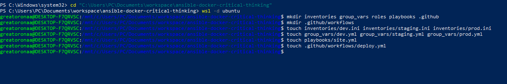


##  Installing and Configuring Docker with Ansible

I wrote an Ansible role named **docker** to automate Docker installation on Ubuntu 22.04 EC2 instances.

In this role, I:
- Installed required system packages
- Added Docker’s official GPG key
- Added the Docker APT repository
- Installed Docker Engine
- Ensured the Docker service was started and enabled
- Added the `ubuntu` user to the Docker group

This ensured Docker was installed consistently across all environments.


### I added Screenshots
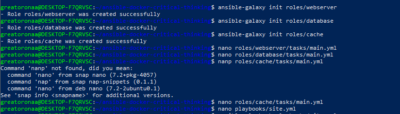
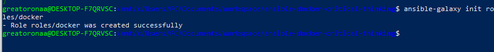
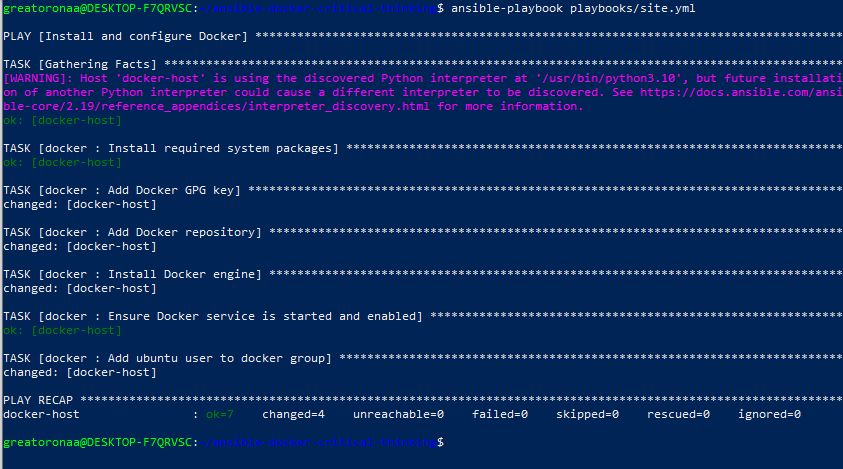
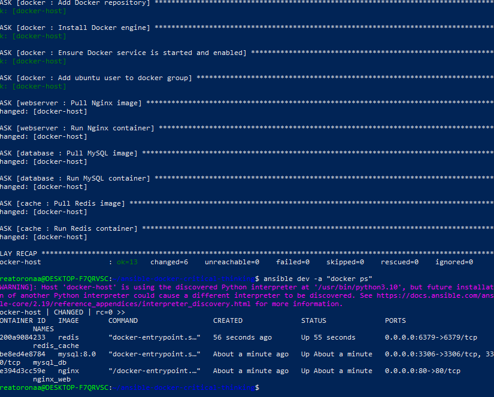
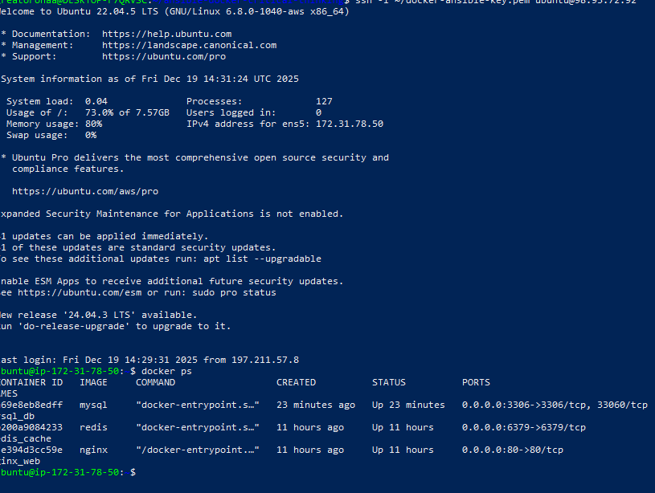


##  Container Deployment with Ansible Roles

I created three separate Ansible roles:

### Web Server Role
- Deployed an Nginx container
- Exposed environment-specific ports
- Ensured the container always runs with `palybook/site/yml`

### I added Screenshots
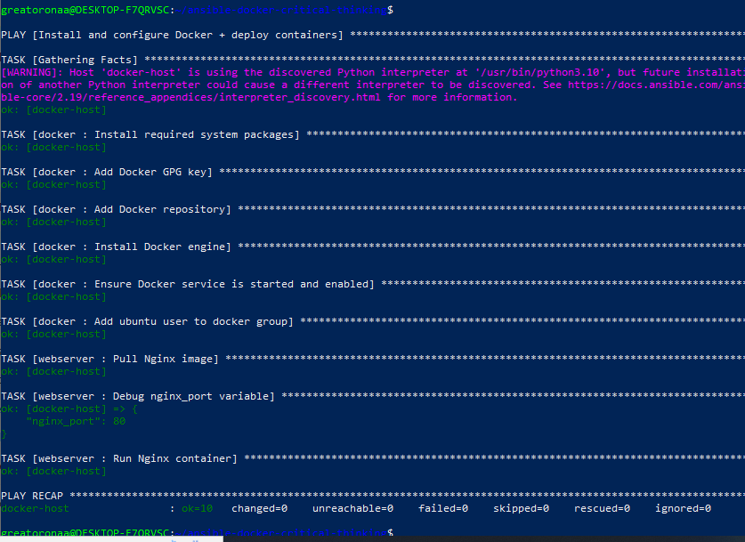

### Database Role
- Deployed a MySQL container
- Configured database name, user, and password using variables
- Persisted data using Docker volumes
- Ensured the container always runs with `palybook/site/yml`

### I added Screenshots
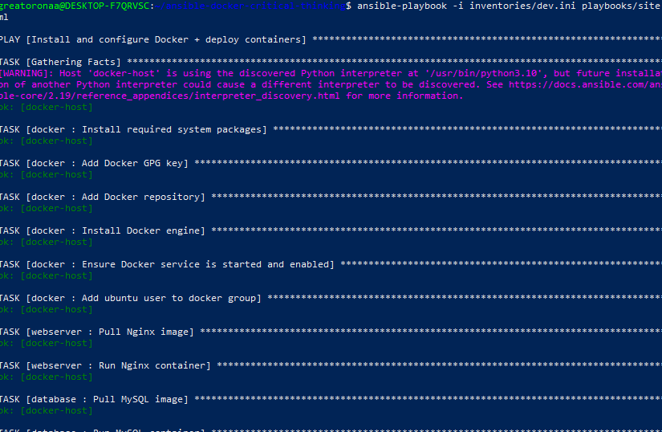

### Cache Role
- Deployed a Redis container
- Configured exposed ports per environment
- Ensured the container always runs with `palybook/site/yml`

I used Ansible’s `community.docker` modules (`docker_container`, `docker_image`) to manage containers declaratively.


### I added Screenshots
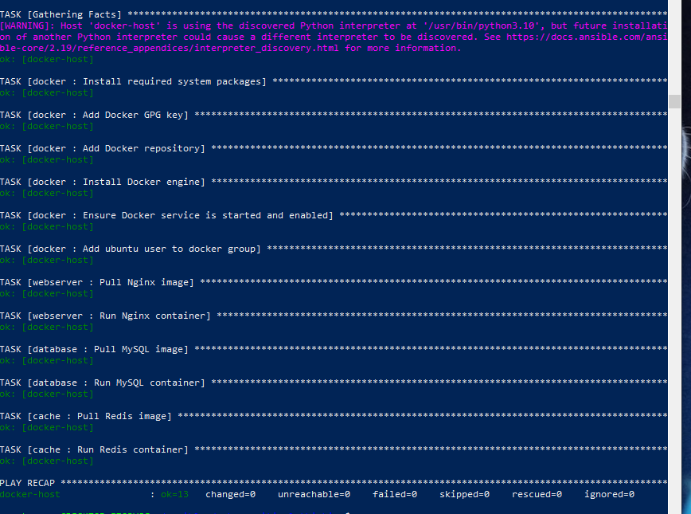

---

##  Environment-Specific Configuration

I configured environment-specific variables using **group_vars**:
- `group_vars/dev.yml`
- `group_vars/staging.yml`
- `group_vars/prod.yml`

Each environment had:
- Different exposed ports
- Different container names
- Different credentials where required

This ensured isolation and flexibility across environments. I ran their playbooks to check the work separately.

### I added Screenshots
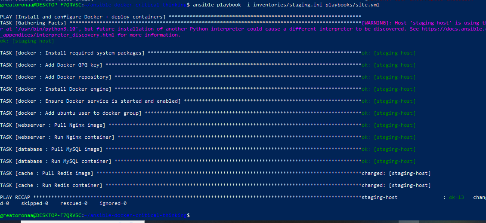
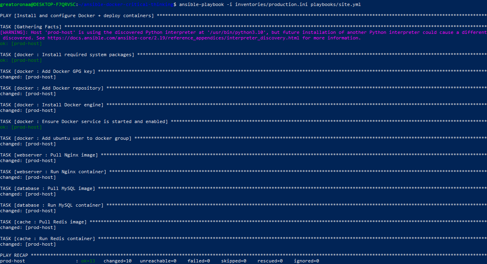

---

##  Automated Deployment with GitHub Actions

I implemented GitHub Actions to automatically deploy containers when code is pushed.

### What I did:
- Created a workflow triggered on `dev`, `staging`, and `master` branches
- Installed Ansible and required Docker collections
- Injected SSH keys securely using GitHub Secrets
- Disabled host key checking for CI reliability
- Dynamically selected the correct inventory based on the branch

This allowed:
- `dev` branch → Development environment
- `staging` branch → Staging environment
- `master` branch → Production environment

### I added Screenshots
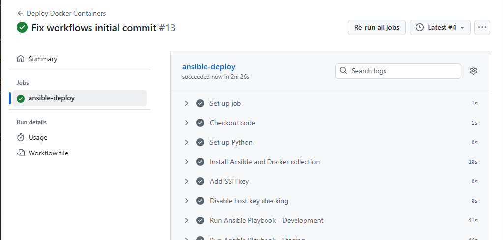
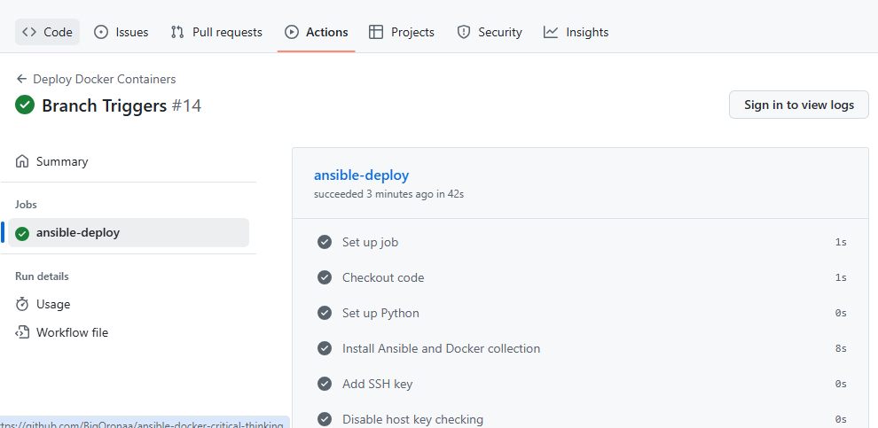

**Errors Encountered and How I Fixed Them**
- Cause: EC2 IP changes and restrictive security group rules
- Fix: Updated inventories, allowed port 22 correctly, verified SSH locally

### I added Screenshots
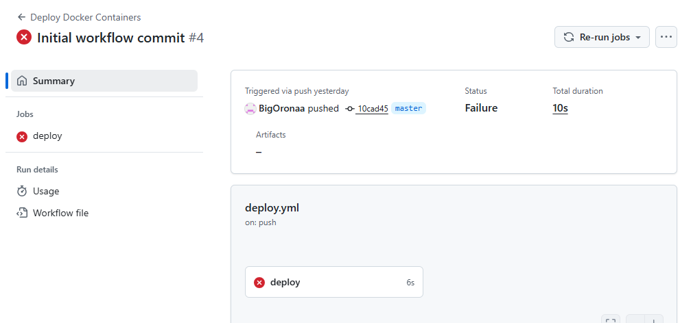

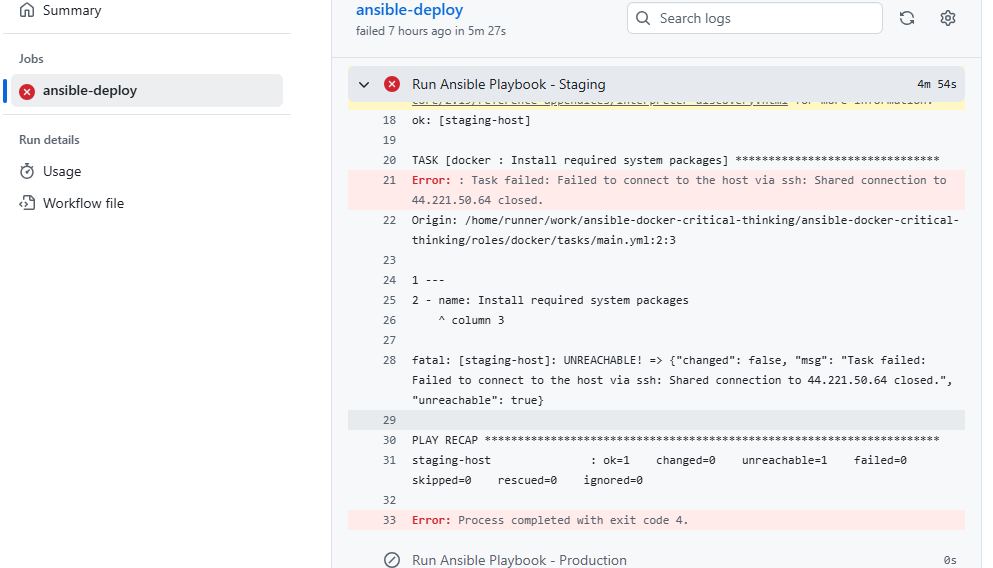


---

##  Monitoring and Logging

I added a monitoring playbook to verify container health.

In this playbook, I:
- Checked if expected containers exist
- Verified that containers are running
- Retrieved recent logs using `docker logs`
- Printed container status and logs for visibility

This ensured I could quickly detect container failures or misconfigurations.


### I added Screenshots
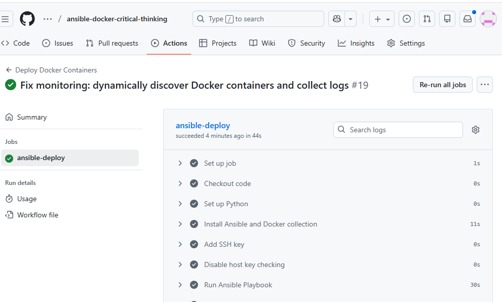

**Error Encountered:** Monitoring Playbook Failures
- Cause: Incorrect container names
- Fix: Verified actual container names created by roles and updated monitoring logic

### I added Screenshots


---

## Notifications

I configured notifications in GitHub Actions to alert on:
- Successful deployments
- Failed deployments

This provided immediate feedback whenever a deployment succeeded or failed.

### I added Screenshots
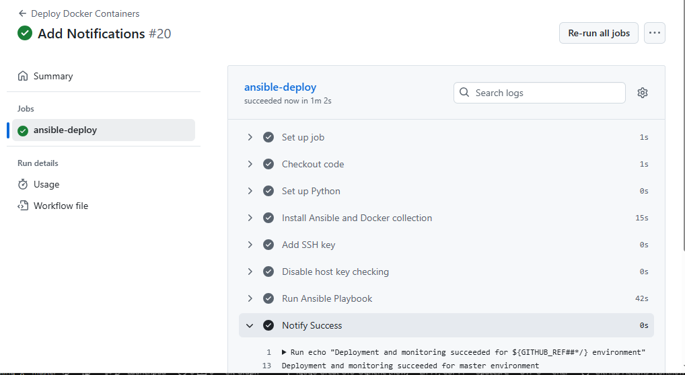


---

##  Testing and Validation

I tested the playbooks locally using Ansible check mode and real executions.  
I validated that:
- Docker installed successfully
- Containers were running correctly
- Ports were accessible
- CI/CD pipelines triggered deployments correctly

---

##  Conclusion

By completing this project, I successfully:
- Automated Docker installation and container deployment with Ansible
- Implemented environment-specific configurations
- Built a reliable CI/CD pipeline with GitHub Actions
- Added monitoring, logging, and notifications
- Documented troubleshooting steps and fixes

This project demonstrates my ability to design, implement, debug, and document a real-world DevOps automation workflow.


**Docker-Ansible Repo** I created a repo that all the github action ran. 
### Link to the repo: [https://github.com/BigOronaa/ansible-docker-critical-thinking](https://github.com/BigOronaa/ansible-docker-critical-thinking)