#  Centralized User and Permission Management with Ansible

---

## Project Objective
I implemented a centralized and automated user and permission management solution using Ansible to manage Development, Staging, and Production Linux servers with environment-specific access control.

---

## Step-by-Step Implementation

### Step 1: Repository and Directory Setup
I created a GitHub repository and structured it following Ansible best practices.  
I separated inventories, playbooks, roles, and automation workflows.

### I added Screenshots
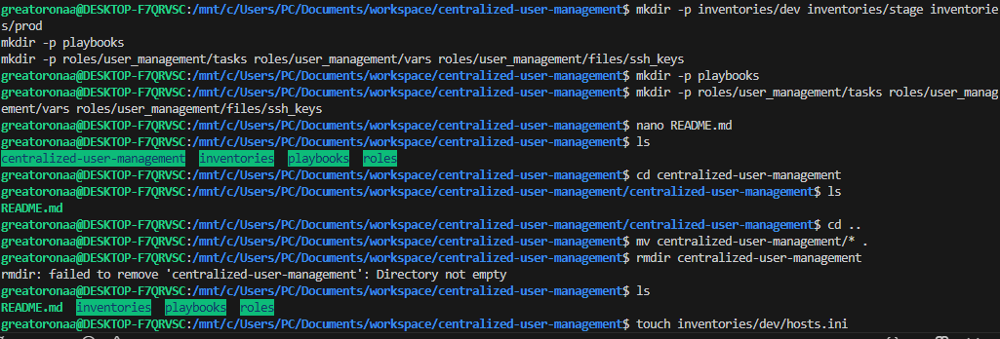

---

### Step 2: Inventory Configuration
I created separate inventory files for Development, Staging, and Production environments.  
This allowed me to target servers independently and enforce environment-specific access rules.

### I added Screenshots
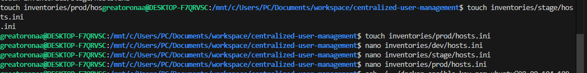

---

### Step 3: Role Creation
I created a reusable Ansible role named `user_management` to handle all user, group, and permission tasks centrally.

### I added Screenshots
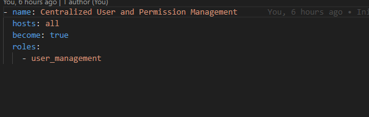

---

### Step 4: User and Group Management
I used Ansible modules to:
- Create Linux users
- Create environment-specific groups
- Assign users to their appropriate groups
- Ensure idempotency across multiple runs

### I added Screenshots
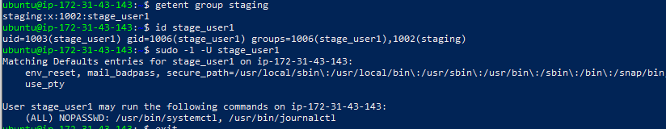
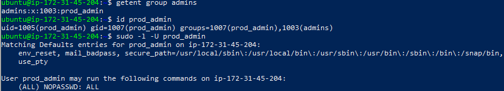
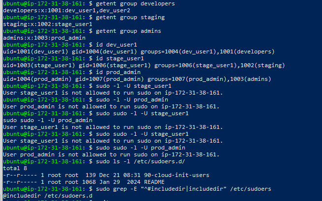
---

### Step 5: SSH Key-Based Authentication
I implemented SSH key-based authentication for all users using Ansible’s authorized_key module. Public SSH keys were defined in environment-specific variables and automatically deployed to each user’s authorized_keys file after account creation. This ensured secure, passwordless authentication and consistent access control across Development, Staging, and Production servers.

---

### Step 6: Role-Based Access Control (RBAC)
I implemented RBAC by:
- Granting no sudo access to development users
- Granting limited sudo access to staging users
- Granting full sudo access to production admins
- Restricting production users from elevated privileges

Sudo permissions were applied using files in `/etc/sudoers.d`.

### I added Screenshots
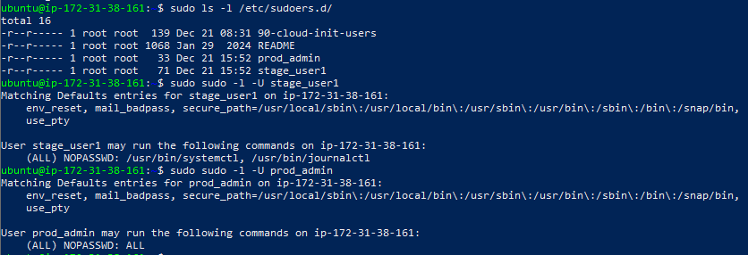

---

### Step 7: Environment Testing
I tested the playbook in:
- Development
- Staging
- Production

I verified:
- User creation
- Group membership
- SSH access
- Correct sudo permissions

### I added Screenshots
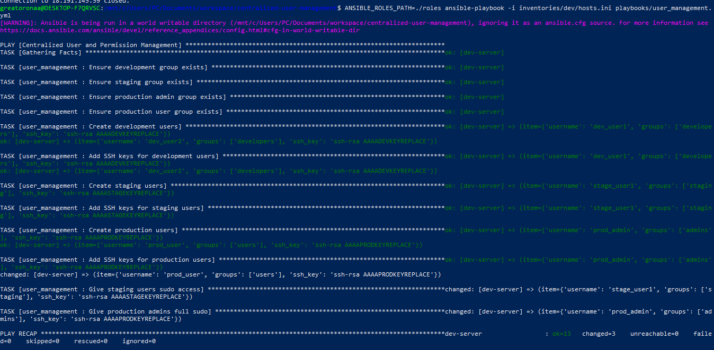
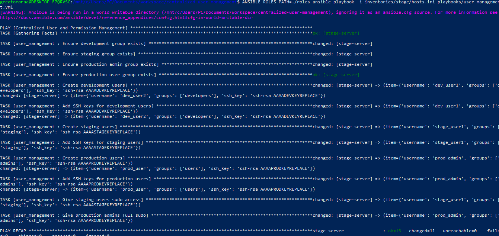
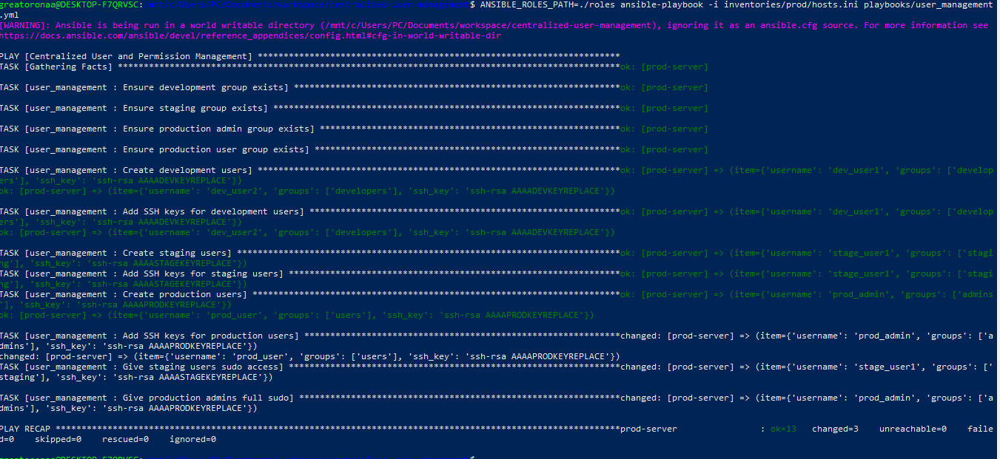

---

### Step 8: Automation with GitHub Actions
I configured a GitHub Actions workflow that automatically runs the Ansible playbook whenever changes are pushed to the repository. I also added a new user to trigger the workflow, This ensures new users or permission changes are applied automatically.

### I added Screenshots
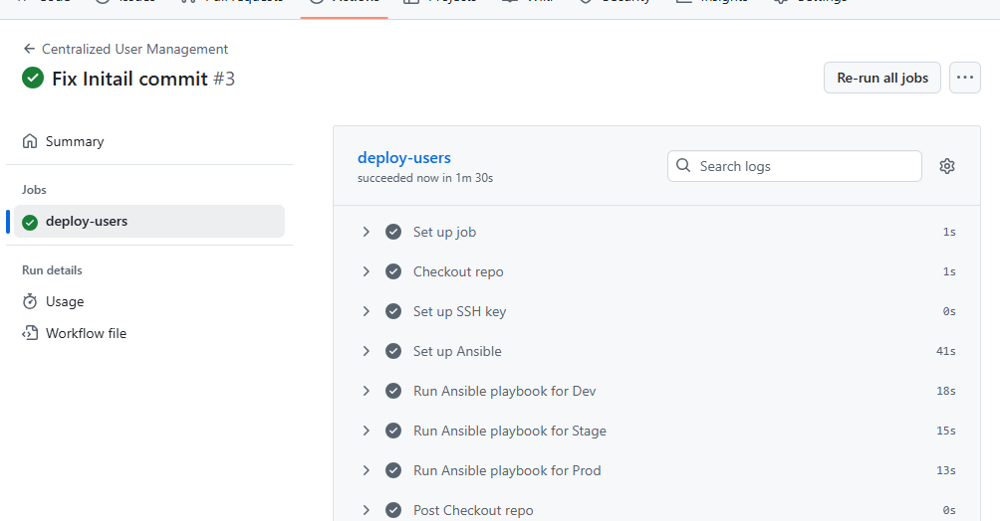
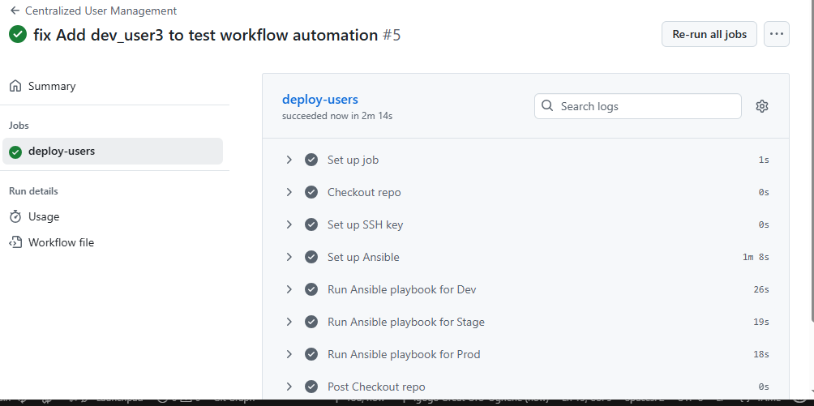

**Errors Encountered and Fixes:** I encountered SSH failures during GitHub Actions execution due to missing private keys. I fixed this by securely storing the SSH private key as a GitHub Secret and loading it during the workflow run.
There was also an error in the `YAML` while adding the 3rd user: `Error: : YAML parsing failed: While parsing a block mapping did not find expected key.`

### I added Screenshots
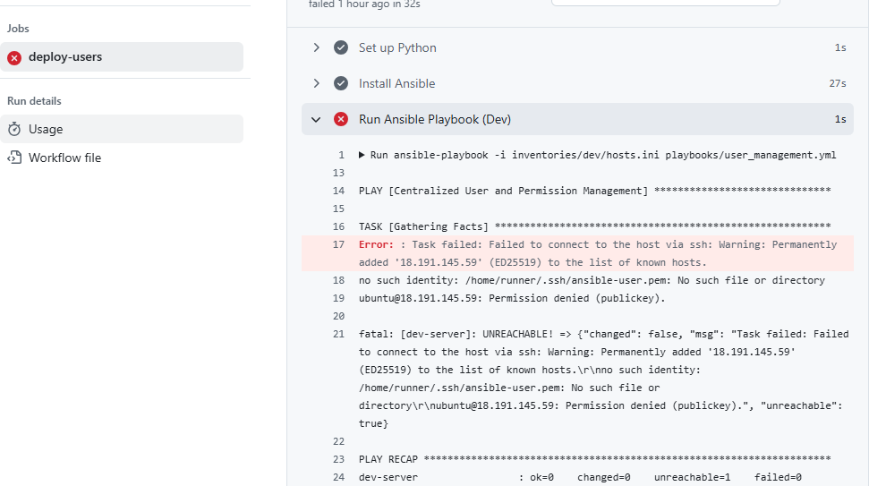
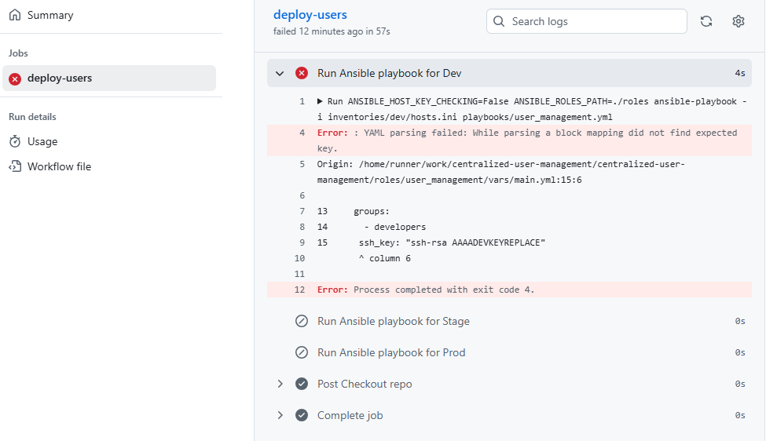

---

### Step 9: Auditing and Logging
I enabled Ansible logging through `ansible.cfg`.  
All playbook executions were recorded in `ansible.log`, including user additions and permission changes.

### I added Screenshots
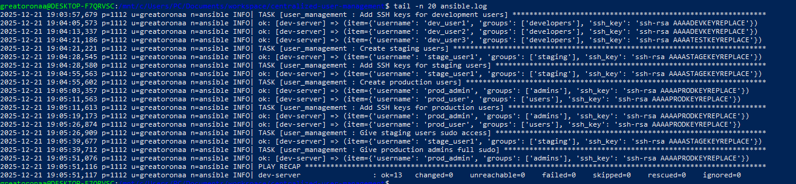

---

## Conclusion
This project demonstrates my ability to:
- Automate system administration tasks
- Apply security best practices
- Implement RBAC
- Integrate CI/CD with infrastructure automation

**Centralized User Repo** I created a repo that all the github action ran. 
### Link to the repo: [https://github.com/BigOronaa/centralized-user-management](https://github.com/BigOronaa/centralized-user-management)