# Configuring Docker Containers with Ansible

## Project Overview

This project demonstrates an automated multi-environment container deployment platform built with Ansible, Docker, and GitHub Actions. The platform provisions and manages containerized services across Development, Staging, and Production environments using reusable Ansible roles, environment-specific configurations, and automated CI/CD workflows.

The solution was designed to standardize deployments, reduce manual operational tasks, and improve deployment consistency across environments while providing monitoring, logging, and deployment visibility.

---

# Architecture Overview

The deployment platform consists of:

- Docker container orchestration using Ansible
- Environment-specific inventory and configuration management
- Automated CI/CD workflows with GitHub Actions
- Monitoring and logging playbooks for operational visibility
- Branch-based deployment automation across environments

Services deployed:
- NGINX Web Server
- MySQL Database
- Redis Cache

Environments managed:
- Development
- Staging
- Production

---

# Repository Structure

```bash
ansible-docker-critical-thinking/
├── inventories/
│   ├── dev.ini
│   ├── staging.ini
│   └── production.ini
├── group_vars/
│   ├── dev.yml
│   ├── staging.yml
│   └── prod.yml
├── roles/
│   ├── docker/
│   ├── webserver/
│   ├── database/
│   └── cache/
├── playbooks/
│   ├── site.yml
│   └── monitor.yml
├── .github/workflows/
│   └── deploy.yml
└── README.md
```

---

# Infrastructure and Deployment Design

## Environment Separation

The infrastructure was structured to support isolated Development, Staging, and Production deployments using separate:
- Inventory files
- Variables
- Container configurations
- Deployment targets

This allowed each environment to maintain independent:
- Port mappings
- Container names
- Credentials
- Runtime configurations

The approach reduced configuration drift and improved deployment consistency across environments.

---

# Docker Automation with Ansible

## Docker Installation Role

A dedicated Ansible role was created to automate Docker installation and configuration on Ubuntu 22.04 EC2 instances.

The role:
- Installed Docker Engine
- Added Docker repositories and GPG keys
- Enabled and started Docker services
- Configured Docker group permissions
- Standardized Docker setup across all servers

This eliminated manual installation steps and ensured identical runtime environments across deployments.

## Verification

```bash
docker ps
```

### Screenshots

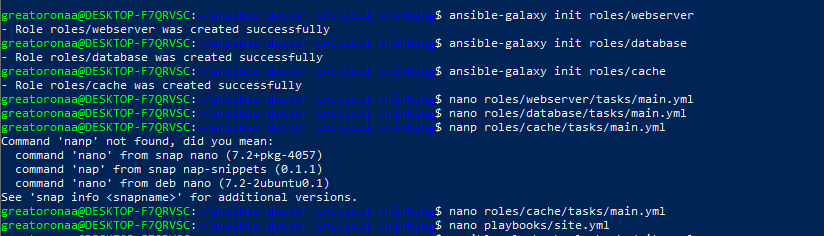

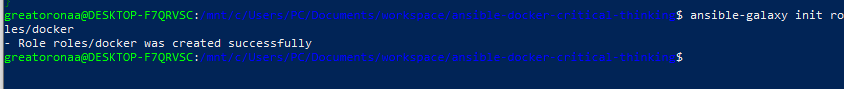

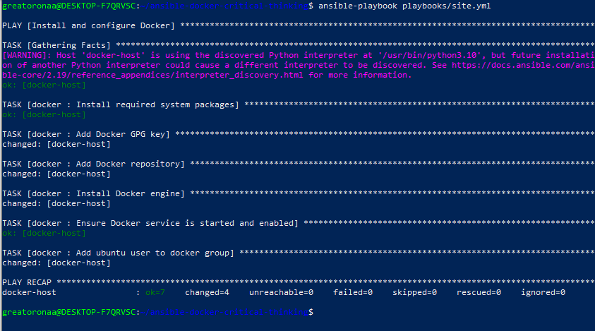

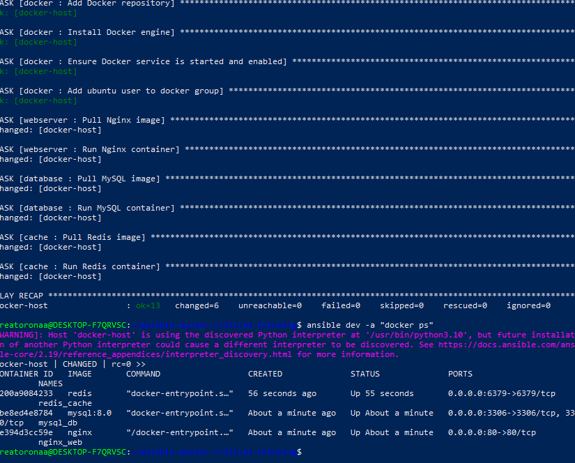

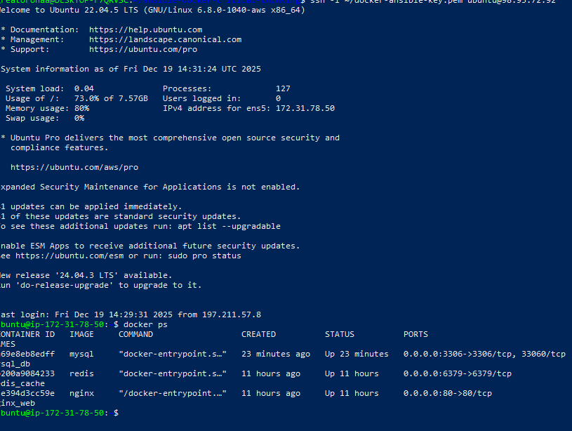

---

# Container Deployment Architecture

## Web Server Deployment

Ansible roles were used to deploy and manage an NGINX container across all environments.

Configuration included:
- Environment-specific port exposure
- Automated container startup
- Declarative container management using Ansible

### Screenshots

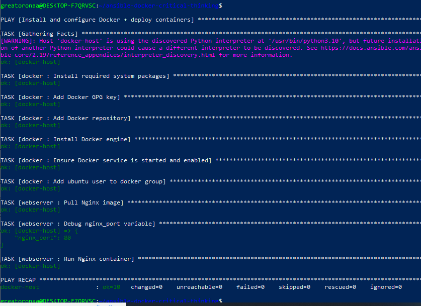

---

## Database Deployment

A dedicated database role was implemented to provision MySQL containers with:
- Persistent Docker volumes
- Environment-specific credentials
- Database initialization variables
- Automated container recovery policies

### Screenshots

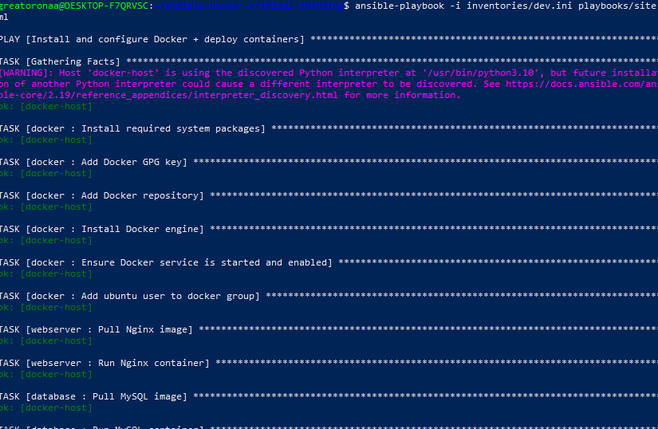

---

## Redis Cache Deployment

Redis containers were deployed using reusable Ansible configurations with:
- Environment-specific networking
- Automated runtime management
- Declarative deployment logic

### Screenshots

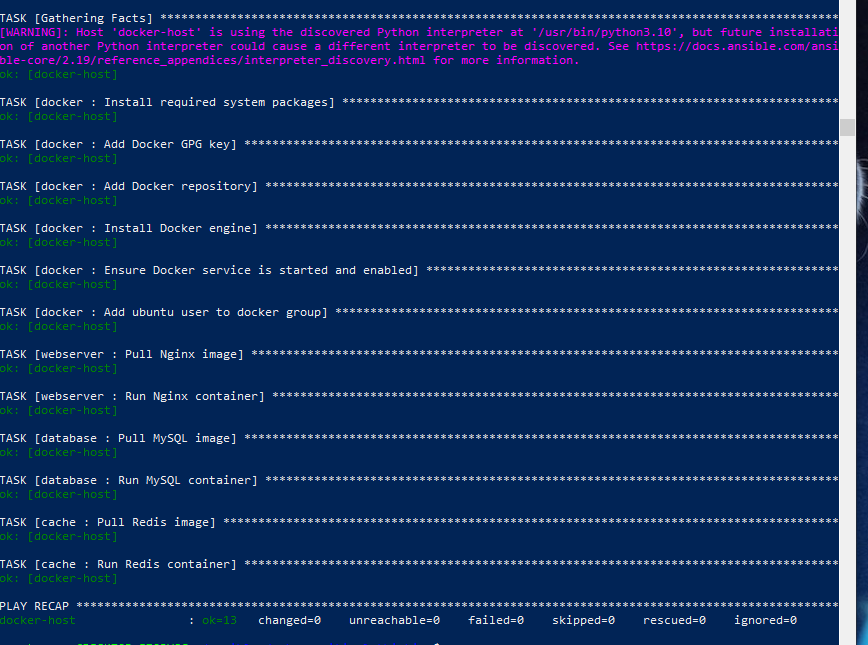

---

# Environment Configuration Management

Environment-specific variables were managed using Ansible group variables:

```bash
group_vars/dev.yml
group_vars/staging.yml
group_vars/prod.yml
```

This structure enabled:
- Centralized configuration management
- Reduced duplication
- Safer environment isolation
- Simplified deployment scaling

Deployment validation was performed independently for each environment.

### Screenshots

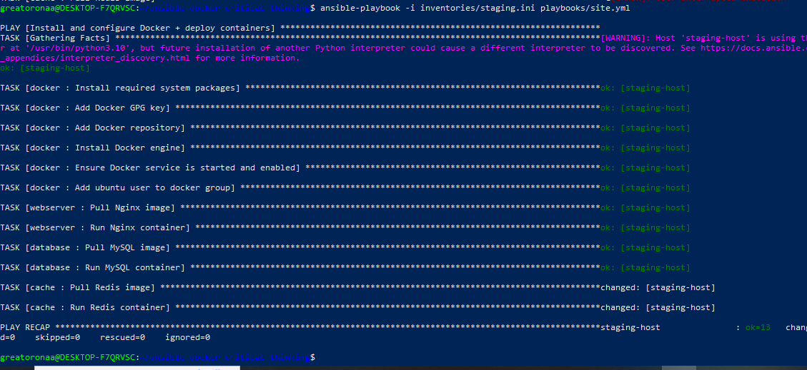

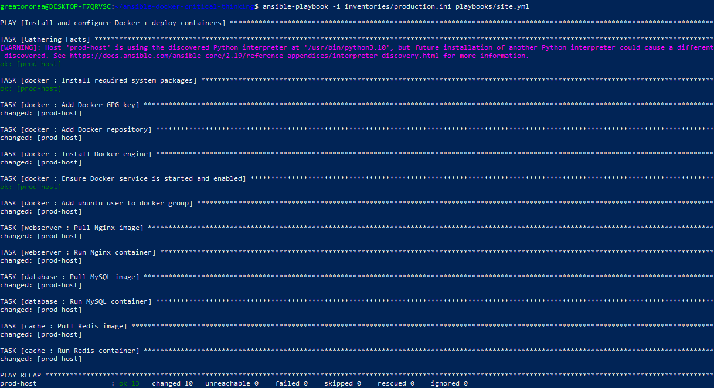

---

# CI/CD Automation with GitHub Actions

## Deployment Workflow Design

GitHub Actions was implemented to automate deployments based on Git branch activity.

Branch-to-environment mapping:
- `dev` → Development
- `staging` → Staging
- `master` → Production

The CI/CD workflow:
- Installed Ansible dependencies dynamically
- Injected SSH credentials securely using GitHub Secrets
- Selected deployment inventories automatically
- Triggered deployments without manual intervention

This reduced repetitive deployment steps and improved release consistency across environments.

### Screenshots

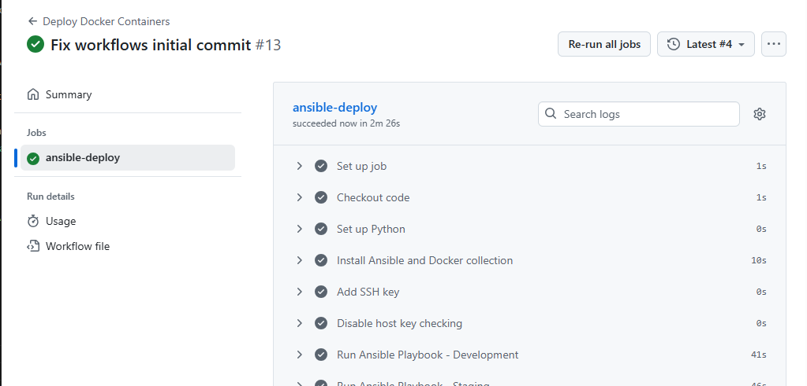

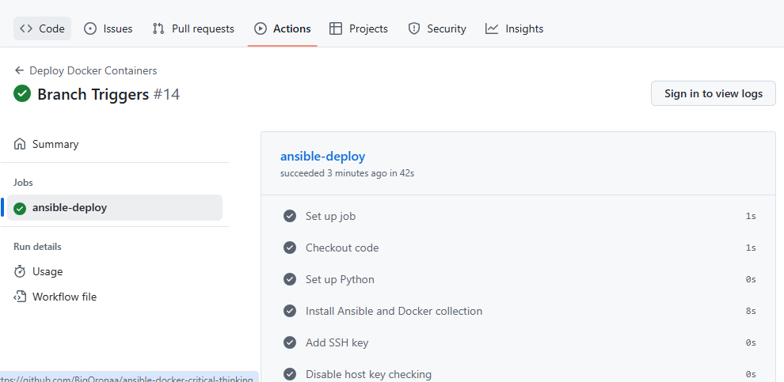

---

# Troubleshooting and Incident Resolution

## SSH Connectivity Failures

### Issue

Deployment failures occurred due to:
- Dynamic EC2 public IP changes
- Restrictive Security Group configurations
- SSH connectivity failures during GitHub Actions execution

### Resolution

The issue was resolved by:
- Updating inventory targets dynamically
- Correcting Security Group inbound rules
- Validating SSH connectivity manually before deployment execution

### Screenshots

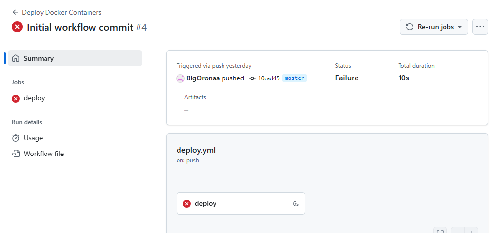

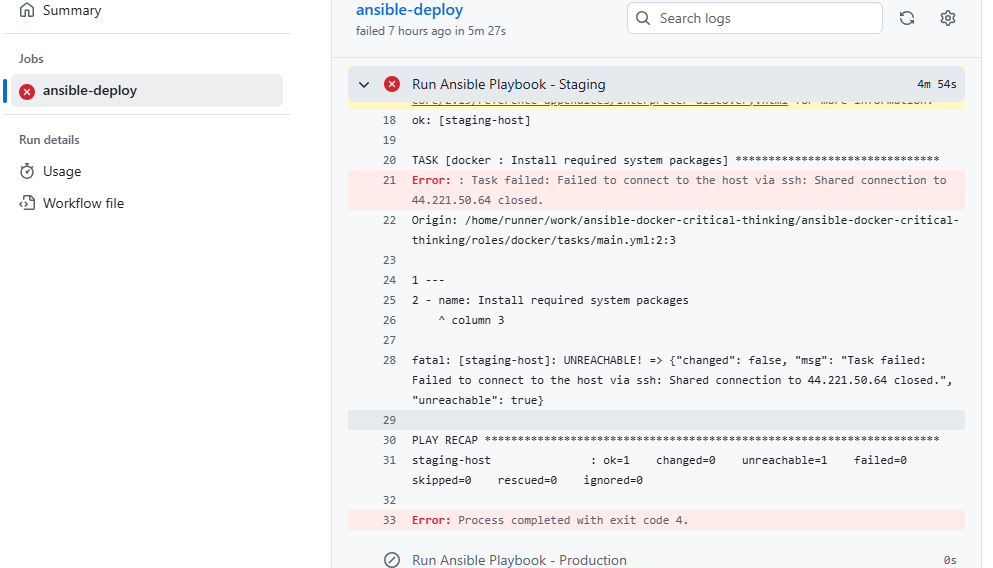

---

# Monitoring and Logging

## Monitoring Playbook

A monitoring playbook was created to validate deployment health across environments.

The playbook:
- Verified container existence
- Checked runtime status
- Retrieved container logs
- Printed deployment health information

This improved operational visibility and simplified troubleshooting during deployment failures.

### Screenshots

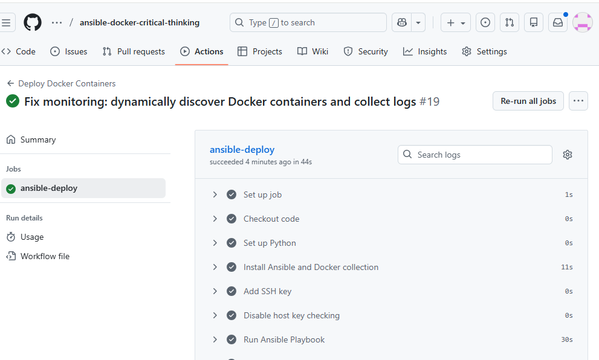

---

## Monitoring Failure Troubleshooting

### Issue

Monitoring tasks initially failed due to incorrect container name references.

### Resolution

Container naming conventions were validated against deployed runtime containers, and monitoring logic was updated to reference correct container identifiers.

### Screenshots

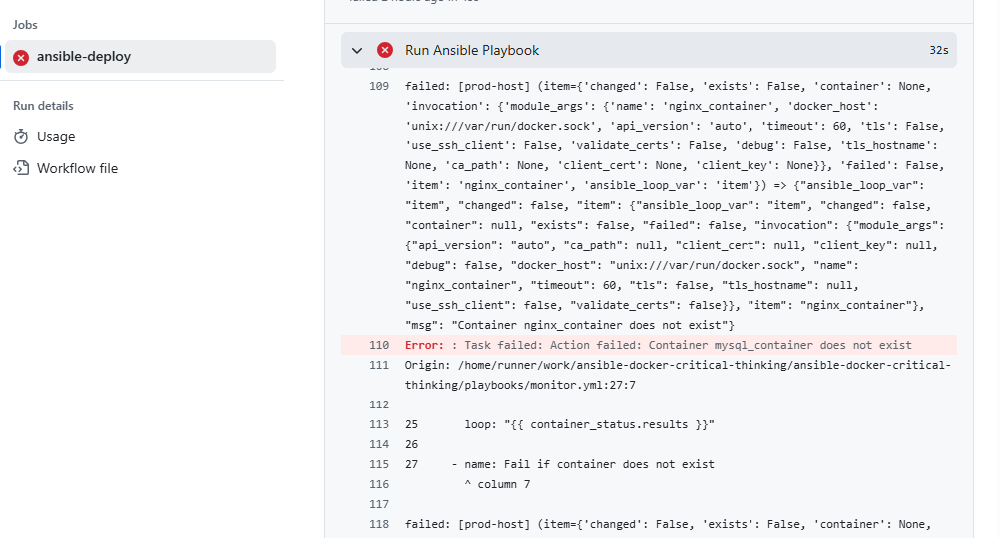

---

# Deployment Notifications

GitHub Actions notifications were configured to provide deployment visibility for:
- Successful deployments
- Failed deployments

This enabled faster operational awareness and reduced response time during deployment failures.

### Screenshots

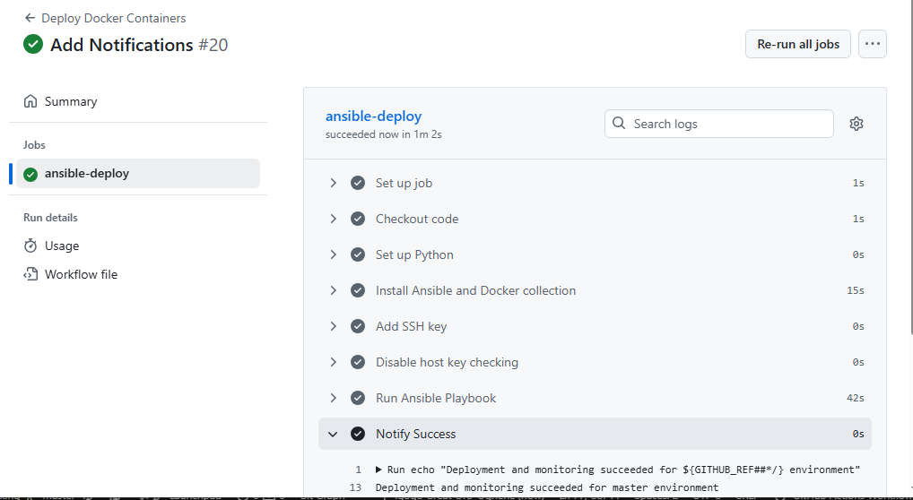

---

# Validation and Testing

Deployment validation included:
- Local Ansible testing
- Playbook execution verification
- Container runtime checks
- CI/CD pipeline testing
- Service accessibility verification

Validation commands included:

```bash
docker ps
ansible-playbook playbooks/site.yml
```

---

# Key Outcomes

By completing this project, I successfully:

- Automated multi-environment Docker deployments using Ansible
- Standardized infrastructure configuration across environments
- Implemented branch-based CI/CD deployment automation
- Reduced repetitive deployment tasks through reusable Ansible roles
- Built deployment monitoring and logging workflows
- Diagnosed and resolved real-world infrastructure and deployment failures
- Improved deployment consistency and operational visibility

---

# Technologies Used

- Ansible
- Docker
- GitHub Actions
- AWS EC2
- Ubuntu 22.04
- NGINX
- MySQL
- Redis

---

# Repository

GitHub Repository:

```bash
https://github.com/BigOronaa/ansible-docker-critical-thinking
```
